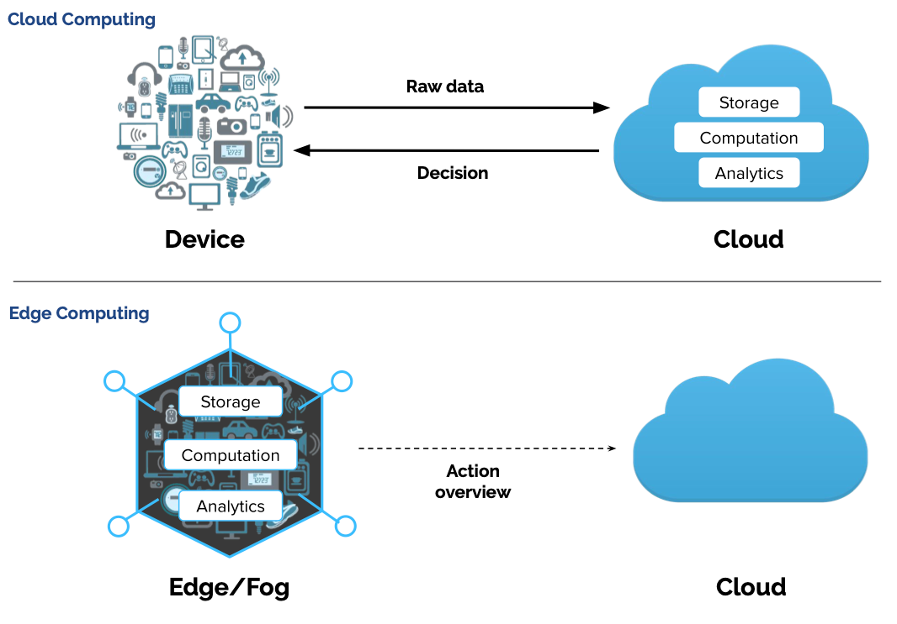
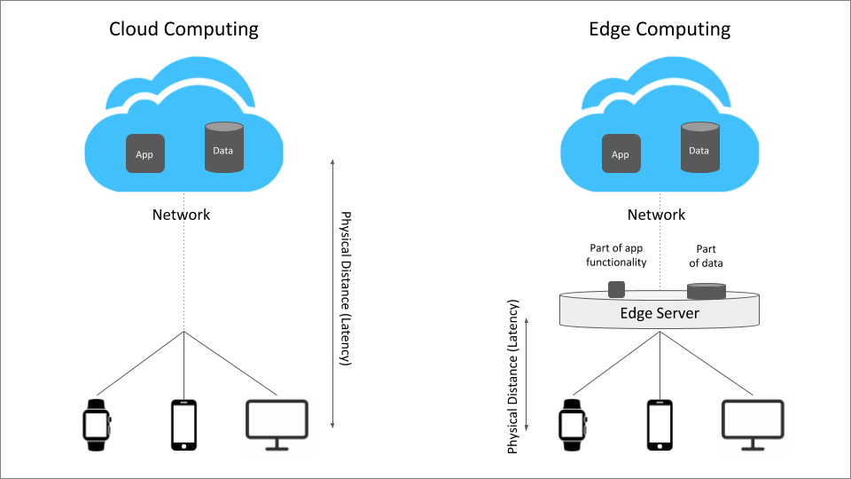
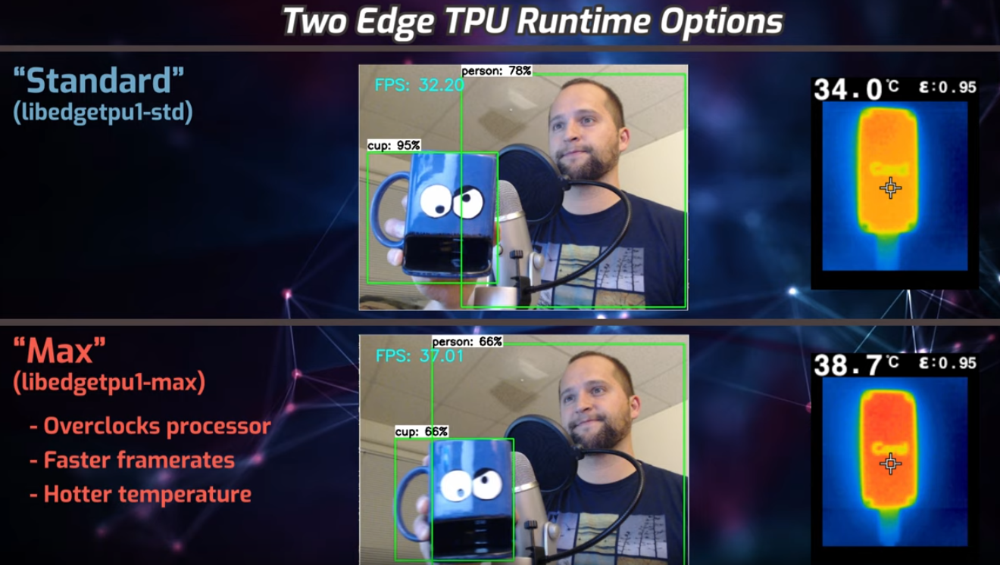
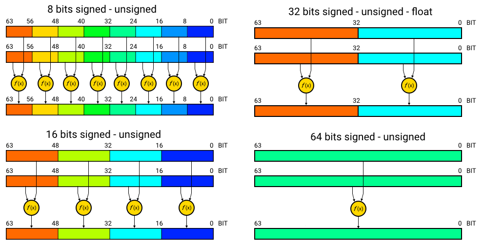
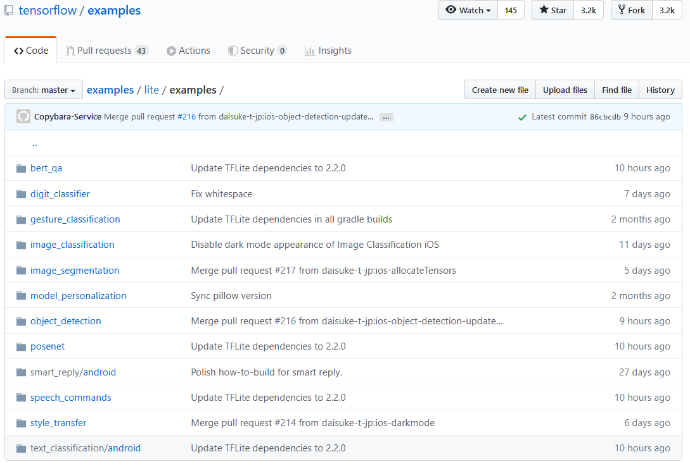

# 라즈베리파이와 머신러닝

이 글은 2017년 출판한 "메이커를 위한 라즈베리파이" 8장에서 소개한 내용을 보완한 것이다.
2017년 당시에는 구글에서 만든 머신러닝 프레임워크 텐서플로의 인기가 대단했지만 라즈베리파이를 위한 정식 버젼이 없었다. 따라서 샘 아브라함이 만든 설치 패키지를 사용하는 방법과 몇가지 예제를 소개했었다. 하지만 3년이 지난 지금에는 구글의 텐서플로는 라즈베리파이를 공식 지원하고 있다. 따라서 정식 버젼을 사용하는 방법과 새로운 예제들을 소개하려고 한다. 본격적인 내용을 소개하기 전에 머신러닝과 관련한 몇가지 개념을 정리하고 머신러닝 분야에서 라즈베리파이를 사용하는 적절한 분야가 무엇인지 한번 고찰해보자.

## 에지 AI 컴퓨팅(Edge AI Computing) Vs.클라우드 AI 컴퓨팅(Cloud AI Computing)
<br />
<image from https://medium.com/natix-io/iot-from-cloud-to-the-edge-challenges-and-perspectives-d29d1477e58c> <br />


클라우드 서비스를 주력으로 제공하는 구글, 마이크로소프트, 아마존 등은 자사의 클라우드에 머신러닝을 위한 고성능 H/W 및 클라우드  SDK를 구축한 후, 사용자들이 일정액의 사용료를 지불하고 자사의 머신러닝 플랫폼을 사용하도록 전략을 취하고 있다. 이들 회사들은 이미 잘 학습이 된 모델을 이용해 개인이나 작은 회사들이 구현하기 힘든 수준의 AI 솔루션을 제공한다. 이들 솔루션들은 다국어 음성인식, 음성합성, 자연어 처리, 챗봇, 사물 인식 서비스를 제공한다.
주로 소프트웨어를 주력으로 하는 IT 회사들은 당연히 클라우드에서 제공하는 AI 서비스를 강조한다. </br>
하지만 다른 한쪽에서는 조금 다른 시각으로 접근하는 회사들이 있다. 이 회사들은 주로 H/W를 주력으로 하는 회사들이다. 그래픽 카드로 유명한 NVidia와 같은 회사들은 머신러닝 학습을 위한 GPU 매출이 상당히 중요하다. 클라우드 서비스를 주력하로 하는 구글, 마이크로소프트, 아마존 등에서 자사의 GPU를 구매해줄 수 있지만 현재의 추세는 이들 회사에서 직접 설계한 머신러닝 가속칩을 칩제조사에 제조 의뢰를 하는 것이다. 따라서 NVidia 입장에서는 클라우드 중심의 머신러닝 패러다임은 자신들이 소외될 수 있는 위험이 존재한다. 또한 스마트폰의 강자 삼성전자의 경우에도 자신들의 스마트폰에서 AI 기능을 직접 실행해 구글의 영향력을 줄이려 할 것이다.
NVidia 입장에서는 그래픽 카드의 전통적인 소비자가 개인이었듯이 수많은 구매자들이 자사의 AI관련 제품을 구매해주는 것이 훨씬 안정적인 사업 전략일 것이다. 4차 산업에서 중요한 요소인 사물인터넷(IoT)은 원격지의 수많은 디바이스에서 정보를 취합하는 것에서 시작한다. 초창기 사물인터넷에서는 디바이스가 센서 + 인터넷의 개념이었기 때문에 센서에서 수집한 정보를 인터넷을 이용해 중앙의 서버에 전송하는 것에만 집중했다. 하지만 디바이스의 성능이 좋아지면서 디바이스에서 간단한 머신러닝을 적용할 수 있는 수준이 되었다. NVidia의 제품 중에는 Jetson 시리즈의 싱글보드 컴퓨터가 있다. 이 제품들은 라즈베리파이 사이즈의 제품임에도 강력한 GPU가 작창되어 있기 때문에 간단한 AI 처리가 가능하다. Xavier와 같은 고급 제품의 경우에는 웬만한 PC + 그래픽 카드 조합보다 더 강력한 AI 연산이 가능하다. 따라서 NVidia와 같은 회사들은 가능하면 클라우드에서 AI 연산을 하는 것보다 단말에서 직접 처리하는 것을 주장한다. 이처럼 단말에서 직접 AI 연산을 처리하는 것을 Edge Computing이라고 한다.</br>
클라우드 컴퓨팅, 에지 컴퓨팅은 어떤 것이 정답이라고 결론을 내릴 수 있는 것은 아니다. 이 두 개념이 각 진영의 기업들의 이익을 대변하는 것처럼 사용자의 입장에서 유리한 설계를 하는 것이 중요하다. 어떤 경우에는 클라우드, 에지 컴퓨팅을 모두 적절히 사용해야 하는 경우도 있을 것이다. 
라즈베리 파이와 같은 경우에도 NVidia Jetson 시리즈처럼 에지 컴퓨팅의 관점에서 접근하는 것이 좋다.

다음 그림처럼 몇개의 IoT 디바이스 또는 센서로부터 수집한 데이터를 무조건 중앙의 서버로 전송하는 것이 아니라 로컬의 에지 서버에서 처리한 다음 가공된 데이터를 전송하는 구조도 가능하다. 라즈베리 파이 또는 NVidia Jetson 제품은 이 그림에서 에지 서버의 역할에 적합할 수 있는 제품들이다.<br/> 

<br />
<image from https://www.trantorinc.com/blog/beginners-guide-edge-computing/attachment/cloud-vs-edge/><br /><br />


## Modeling vs.Inference
그리고 머신러닝에는 크게 두가지 분야가 있다. 첫번째는 AI 모델을 만드는 것이다. 다양한 머신러닝 기법을 이용해 모델을 설계하고, 학습용 데이터를 적용시켜 모델을 학습시킨다. 이 과정은 많은 시간과 좋은 하드웨어, 전문적인 지식을 필요로 한다.
그리고 두번째는 앞의 과정에서 만든  AI 모델을 활용해 다양한 응용 솔루션을 만드는 것이다. 이 과정은 머신 러닝에 대한 깉은 지식이 없더라도 프로그래밍에 대한 기초 지식과 아이디어만 있다면 누구나 할 수 있다. 많은 경우 머신러닝 분야를 첫번째로 국한해서 생각하는 경우가 많지만 절대 그렇지 않다. 구슬이 서말이라고 꿰어야 보배라는 말이 있듯이 아무리 잘 만든 AI 모델이라 하더라도 뛰어난 응용 소프트웨어가 제공되지 않는다면 가치가 전혀 없다. 오히려 4차 산업 혁명의 시기에 필요한 창의성을 발휘할 수 있는 분야는 두번째이다. <br />
라즈베리 파이, 젯슨 시리즈는 두번째 경우에 필요한 물건들이다. 이처럼 이미 만들어진 모델에 이미지 등의 입력값을 넣어서 AI가 적용된 출력값을 구하는 것을 Inference라고 한다. 당연히 우리는 Inference에 집중할 것이다. Inference에 필요한 모델은 지금도 수많은 머신러닝 전문가들에 의해 만들어지고 개선되고 있다. 우리는 이 모델들을 가져다 사용하면 된다.  
<br />
<image from https://blogs.nvidia.com/blog/2016/08/22/difference-deep-learning-training-inference-ai//> <br /><br />


## 라즈베리파이는 머신러닝에 적절한가?

이 질문에 대한 나의 답변은 "No"이다. 라즈베리 파이는 제작자 업튼의 말처럼 범용 컴퓨팅을 위해 만든 제품이다. 즉 저렴한 가격에 컴퓨터를 보급하는 것에 목적을 둔 제품이다. 라즈베리파이에는 AI 가속을 위한 GPU 또는 TPU(Tensor Processing Unit)가 없다. 라즈베리파이의 말리 GPU를 이용하려는 일부 움직임이 있지만 큰 기대를 하지 않는 것이 좋을 것 같다. 따라서 라즈베리파이를 에지 AI용으로 사용하려면 낮은 성능으로 인해 상당히 실망할 수 있다. 하지만 NVidia의 Jetson Nano, Xavier, TX2와 같은 제품들은 제작 당시부터 머신러닝의 Inference 용도를 염두에 두고 개발되었다. 즉 NVidia 제품들은 NVidia의 CUDA GPU를 내장하고 있으며 OS 이미지 역시 머신러닝용 S/W를 최적화해서 제공하고 있다.<br />
>⚠️ ***Tip***: 젯슨 나노를 선택하더라도 낮은 성능으로 인해 실망할 수 있다. 에지 AI에서도 상당한 수준의 AI 컴퓨팅 능력을 필요로 한다는 것을 느낄 수 있다.

따라서 에지 AI 컴퓨팅용으로 55$의 라즈베리파이 4 4GB 모델과 99$의 젯슨 나노 중 선택해야 한다면, 나는 넷슨 나노를 선택할 것이다.

하지만 라즈베리파이에도 대안이 있다. 구글의 USB 타입 AI 가속기 CORAL을 사용하거나 인텔의 Movidius AI 가속 스틱을 이용하는 것이다. 구글의 CORAL은 USB에 연결해 사용이 가능한 AI 가속기이며 리눅스, 맥, WIndows에서 모두 사용 가능하다. 라즈베리파이 4에서는 다행스럽게 USB3.0을 지원한다. USB 2만 지원하는 파이 3에서는 전송 속도가 낮아서 CORAL의 성능을 100% 활용할 수 없다. 그리고 CORAL AI 가속기는 에지 컴퓨팅에서만 사용 가능하다. 즉 학습용으로는 사용이 불가능하다.

라즈베리파이 만큼 좋은 생태계를 가진 싱글보드 컴퓨터는 없다. 사용 도중 발생하는 문제점은 항상 수많은 사용자, 개발자들로부터 도움을 받을 수 있다. 따라서 이미 라즈베리파이를 사용한 솔루션에 AI  기능을 추가하고 싶은 경우 또는 라즈베리파이에 익숙한 분들은 라즈베리파이 + AI 가속기를 사용하는 방법을 추천한다.

가끔 유튜브 동영상 또는 블로그에서 라즈베리파이에서 AI 가속기 없이 텐서플로를 이용해 사물인식 등을 구현, 소개한 것을 볼 수 있다. 개발지식 획득이라는 측면에서는 도움이 되지만 상용 제품 개발을 염두에 둔다면 AI 가속기를 함께 사용하는 것이 좋다. 다행히 구글의 텐서플로는 기존 텐서플로용으로 만들어진 모델을 CROAL AI 가속기용으로 쉽게 변환하는 방법을 제공한다. <br /><br />


## 구글 CORAL 라즈베리파이 4 에 설치하기
이미지를 이용한 예제들이 많기 때문에 Rasbian Desktop을 사용하는 것이 무난하다. Lite 버젼을 사용한다면 예제 코드를 수정해 화면 출력을 파일 출력으로 바꾼 후 인퍼런스 작업이 끝난 후 파일을 통해 확인하면 된다. 부팅 이미지 제작은 "메이커를 위한 라즈베리파이 " 1장을 참조한다.

### OS 설치
1. Rasbian Desktop 버젼을  https://www.raspberrypi.org/downloads/raspbian/ 에서 다운로드 받는다.
2. 클래스 10, 32GB 이상의 마이크로 SD 카드를 준비 후 Win32Diskeeper 또는 Etcher를 이용해 이미지를 만든다.
3. raspi-config를 실행해 카메라를 활성화시킨다.
4. raspi-config를 실행해 추가로 필요한 설정 작업을 진행한다.
5. apt-get update
6. apt-get dist-upgrade
7. 리부팅한다.</br></br> 


### CORAL 소프트웨어 설치

공식 홈페이지 https://coral.ai/docs/accelerator/get-started/#requirements의 정보를 이용한다.<br /><br />
<br />
<USB 타입 Coral AI 가속기></br></br> 

>⚠️ ***Warning***: 아직 Coral AI 가속기는 라즈베리파이에 연결하지 않는다.

먼저 Coral에 필요한 데비안 패키지를 설치한다. 앞의 명령어 2개는 repo를 추가하는 과정이며 마지막 명령은 추가한  repo(저장소)를 반영하는 것이다. 따라서 반드시 "apt-get update"를 한 다음에 "libedgetpu1-std"를 설치해야 한다.
``` bash
echo "deb https://packages.cloud.google.com/apt coral-edgetpu-stable main" | sudo tee /etc/apt/sources.list.d/coral-edgetpu.list
curl https://packages.cloud.google.com/apt/doc/apt-key.gpg | sudo apt-key add -
sudo apt-get update
```

</br></br> Edge TPU 런타임을 설치한다. Edge TPU 런타임은 std 버젼과 max 버젼 2개가 존재한다. max버젼은 CORAL AI 가속기의 프로세싱 유닛을 오버클로킹한다. 따라서 처리 속도가 조금 빨라지지만 대신 가속기의 온도가 올라간다. PC CPU 오버클로킹과 유사하다고 보면 된다. 만약 max 버젼을 사용하고 싶다면 libedgetpu1-std 대신 libedgetpu1-max를 설치한다.
다음 그림은 두개의 차이를 보여주는 유튜브 동영상이다. 구글 홈페이지에서는 std 버젼의 사용을 권하고 있다. 하지만 일부 모델의 경우에는 max를 사용하지 않으면 제대로 작동하지 않는 경우가 있다.  https://github.com/google-coral/project-posenet의 예제 중에서 posenet은 max 런타임을 사용해야 정상 작동한다. 그 이유는 표준 모델의 성능으로는 제대로 처리할 수 없을 정도로 모델이 강력한 성능을 요구하기 때문이다.<br /><br />
<br />
< https://www.youtube.com/watch?v=qJMwNHQNOVU >
``` bash
sudo apt-get install libedgetpu1-std
```

이제 Coral AI 가속기를 USB 3.0 포트에 연결한다.</br></br>

## 텐서플로 Lite 설치

>⚠️ ***Warning***: 라즈베리파이에서 텐서플로 Lite 버젼이 아닌 정식 버젼을 사용하는 것은 가능하다. 하지만 CORAL AI 가속기와 함께 사용하려면 반드시 Lite 버젼을 사용해야 한다. CORAL AI 가속기 없이 라즈베리파이에서 텐서플로 정식버젼을 사용하는 것과 Lite 버젼과 CORAL AI 가속기를 함께 사용했을 경우의 수십배의 속도 차이가 난다.

텐서플로 Lite는 Android, iOS, 리눅스 등 다양한 모바일 환경과 임베디드 시스템에서 머신러닝 모델을 사용할 수 있게 개선한 기존의 텐서 플로의 경량화 버젼이다.
처음에는 AI 가속 칩이 없는 스마트 폰에서 텐서플로를 작동시키기 위해 만들어졌으며 안드로이드 버젼과 IOS 버젼이 2017년 11월 Preview 버젼이 공개되었다. 이후 ARM32, ARM64를 사용하는 리눅스 시스템에 대한 지원이 추가되면서 라즈베리파이, NVidia 젯슨 시리즈, 오드로이드 등의 SBC에서도 사용이 가능해졌다.

텐서플로 Lite는 부동소수점을 8비트 정수로 변환해 처리하기 때문에 딥러닝 모델을 상대적으로 빠르게 처리할 수 있다. 다만 정수처리로 인한 오차로 인해 inference 결과값의 정확도가 조금 낮아진다. 참고로 다음 그림은 ARM 계열 CPU에서 병렬처리의 효율을 보여주는 그림이다. 8비트 정수를 처리하는 성능이 64비트 부동 소숫점을 처리하는 것보다 8배 효율적임을 보여준다. 아마도 텐서플로 Lite가 설치된 많은 디바이스들이 ARM CPU를 사용하기 때문에 이런 최적화를 사용하는 것 같다.</br></br>
<br />
<https://qengineering.eu/deep-learning-algorithms-for-raspberry-pi-and-alternatives.html>

"메이커를 위한 라즈베리파이" 책이 나올 당시에는 텐서플로 Lite 버젼이 없었다. 따라서 ARM32 CPU에 맞춰 소스 코드를 직접 빌드하는 어려운 과정을 거쳐야 했다. 책에서 소개한 샘 아브라함의 설치 파일 역시 이 과정을 거쳐 만들어진 것이다. 하지만 이제는 쉽게 텐서플로 Lite를 설치할 수 있다.


먼저 여러분 파이의 정확한 파이썬 3 버젼을 확인한다. 참고로 Rasbian Buster 버젼에서는 3.7 버젼을 사용하고 있다.
``` bash
pi@raspberrypi:~ $ python3
Python 3.7.3 (default, Dec 20 2019, 18:57:59) 
[GCC 8.3.0] on linux
Type "help", "copyright", "credits" or "license" for more information.
>>>
```

아래 설치 명령에서 cp37은 파이썬 3.7을 의미한다. 반드시 자신의 라즈베리파이에 설치된 파이썬 버젼에 맞는 설치 파일을 사용한다. https://www.tensorflow.org/lite/guide/python 페이지에 다른 버젼의 파이썬을 사용하는 경우 사용 가능한 설치 파일 목록이 있다. 만약 다른 버젼의 파이썬을 사용한다면 이 페이지를 참조해서 적절한 설치 파일을 사용한다.

``` bash
pip3 install https://dl.google.com/coral/python/tflite_runtime-2.1.0.post1-cp37-cp37m-linux_armv7l.whl
```
</br></br>

## 예제 코드 설치
Github에서 예제를 다운로드 설치한다. 원하는 작업 디렉토리로 이동한 후 다음 작업을 한다. 만약 pi 사용자 홈 디렉토리가 아니라면 sudo 명령어를 함께 사용해야 할 수도 있다.

``` bash
mkdir coral && cd coral
git clone https://github.com/google-coral/tflite.git

cd tflite/python/examples/classification
bash install_requirements.sh
```
</br></br>다음과 같이 예제를 실행해본다.
``` bash
root@raspberrypi:/usr/local/src/coral/tflite/python/examples/classification# python3 classify_image.py --model models/mobilenet_v2_1.0_224_inat_bird_quant_edgetpu.tflite --labels models/inat_bird_labels.txt --input images/parrot.jpg
----INFERENCE TIME----
Note: The first inference on Edge TPU is slow because it includes loading the model into Edge TPU memory.
17.2ms
4.2ms
4.2ms
4.3ms
4.2ms
-------RESULTS--------
Ara macao (Scarlet Macaw): 0.77734
```

위처럼 결과가 출력된다면 제대로 설치된 것이다. --input 파라미터에 앵무새 그림(parrot.jpg)를 넣었는데 정확하게 Scarlet Macaw로 인식했으며, 확률값을 0.77734로 출력했다.</br></br>

## 추가 패키지 설치
라즈베리파이에서 에지 AI 컴퓨팅은 대부분 이미지와 관련된 것들이다. 가령 파이 카메라를 이용해 사물을 인식하거나 자세 예측(Pose Estimation), 사람의 얼굴 또는 신체에서 키포인트를 추출하는 것들이다. 따라서 이미지 처리를 위한 OpenCV, PIL 등의 패키지를 미리 설치해두면 도움이 된다.


### OpenCV 설치
여러분의 라즈비안 버젼에 따라 다음에서 설치한 패키지 이외에 추가 패키지 설치가 필요할 수 있다. 만약 마지막 "pip3 install opencv-python"에서 에러가 발생한다면 에러 메시지를 분석해 추가 패키지를 설치한다. 
``` bash
sudo apt-get update
sudo apt-get install -y libatlas-base-dev gfortran  openexr libqtgui4 libqt4-test   
sudo apt-get install -y libavcodec-dev libavformat-dev libswscale-dev libv4l-dev libjasper-dev libilmbase-dev libopenexr-dev
pip3 install opencv-python
```

그리고 사용자의 .bashrc 파일을 수정해 다음 라인을 추가한다.
``` bash
export LD_PRELOAD=/usr/lib/arm-linux-gnueabihf/libatomic.so.1
```

``` bash
#위 내용을 추가
vi ~/.bashrc
#변경 내용을 현재 shell에 적용
source ~/.bashrc
```
<br /><br />

## 텐서플로 Lite 공식 예제
텐서플로 Lite의 사용법을 배우고자 한다면 구글에서 제공하는 공식 에제를 참조하는 것이 가장 좋다.
https://github.com/tensorflow/examples/tree/master/lite/examples 사이트에서 텐서플로 Lite 예제를 찾을 수 있으며 IOS, android, raspberry_pi 3가지로 제공한다. IOS, android 버젼은 대부분 제공하지만 라즈베리파이 버젼은 아직 모든 예제에 대해 제공하지는 않는다.

<br />
<https://github.com/tensorflow/examples/tree/master/lite/examples>

<br /><br />

## Coral AI 가속기에서 사용할 수 있는 모델
https://coral.ai/models 페이지에서는 Coral ai  가속기를 위해 만들어 둔 모델들을 제공한다. 여기에서 제공하는 모델들은 모두 영상 처리를 위한 모델들이다. 이 모델은은 수시로 업데이트 될 수 있으니 관심있는 분들은 한번씩 체크하는 것이 좋다.

>⚠️ ***Warning***: Coral AI 가속기에서 사용가능한 모델과 텐서플로 Lite에서 사용가능한 모델은 차이가 있다. 텐서플로 Lite는 Coral AI 가속기가 없는 안드로이드, IOS 기기에서도 작동하기 때문에 Coral AI에서 사용할 수 있는 모델을 포함해서 더 많은 모델을 제공한다. 텐서플로 Lite에서 제공하는 모델의 종류는 https://www.tensorflow.org/lite/models?hl=ko에서 확인할 수 있다.

### 이미지 분류(Image classification)
이미지 분류는 inference 이미지가 어떤 종류인지 분류하는 모델이다. 다음에 설명할 사물 인식(Object Detection)과 차이점은 사물 인식이 이미지에서 여러개의 사물을 찾는데 반해 이미지 분류는 모델에서 학습한 클래스 중 확률이 가장 높은 하나로 분류한다는 것이다. 즉 이미지를 비행기, 트럭, 배와 같이 특정 사물로 분류하는 것이다.<br /><br />
<br />
제공하는 모델들은 EfficientNet, MobileNet V1, MobileNet V2, MobileNet V2(곤충), MobileNet V2(식물), MobileNet V2(새), Inception V1, Inception V2, Inception V3, Inception V4 가 있다.

### 사물인식(Object detection)
사물 인식은 이미지에 포함된 사물의 종류와 영역을 찾는다.
<br />

제공하는 모델들은 MobileNet SSD v1 (COCO),MobileNet SSD v2 (COCO), MobileNet SSD v2 (Faces)가 있다. 

### Semantic segmentation
이미지에서 같은 의미를 가지는 영역들을 나눈다. 다음 그림에서 차들은 푸른색, 사람은 붉은색, 건물은 회색, 인도는 핑크색으로 표현되고 있는 것을 알 수 있다.

<br />
제공하는 모델들은 MobileNet v2 DeepLab v3 (0.5 depth multiplier),MobileNet v2 DeepLab v3 (1.0 depth multiplier) 가 있다.<br /><br />


## 새 분류(Bird Classification) 예제
https://coral.ai/models 페이지에서는 제공하는 모델들을 사용하는 방법을 알아보자. 하나의 모델만 사용할 줄 알면 나머지 모델들 역시 사용 방법은 거의 동일하기 때문에 쉽게 적용할 수 있다. 다음의 4과정을 거친다.

1. 네트워크 모델을 메모리(Coral AI 가속기)에 로딩. 
2. 인퍼런스 데이터를 모델의 입력값 형식에 맞게 조절(모델이 입력받는 이미지 사이즈 및 RGB 형식이 미리 정해져 있다.)
3. 로딩한 모델에 인퍼런스 데이터 입력
4. 모델에서 연산을 거쳐 출력한 값을 적절하게 변환 해석. 이 과정에서 라벨(일종의정답지)이 필요할 수 있다.


앞에서 https://github.com/google-coral/tflite.git 페이지의 예제를 설치했었다. 설치 디렉토리를 살펴보면 tflite/python/examples/classification/models# 가 존재한다. 그리고 tflite 확장자의 모델 파일이 2개, txt 파일이 1개 존재한다. 이 파일들은 https://coral.ai/models 페이지에서 제공하는 모델들 중 MobileNet V2 (iNat birds)와 동일하다.
우리는 coral AI 가속기를 이용할 것이기 때문에 mobilenet_v2_1.0_224_inat_bird_quant_edgetpu.tflite 파일을 모델로 이용할 것이고 이 모델을 이용해 인퍼런스 데이터를 입력한 후 출력값을 이용해 실제 새 이름을 찾을 때에는 라벨 파일인 inat_bird_labels.txt을 이용할 것이다. inat_bird_labels.txt파일의 내용을 열어보면 0 ~ 964까지의 번호와 번호에 해당하는 새이름이 존재한다. 네트워크 모델의 출력값이 0 ~ 964까지의 숫자로 나오면 이 라벨 파일을 이용해 다시 새 이름을 찾을 수 있다.

``` bash
root@rpi-coral:/usr/local/src/coral/tflite/python/examples/classification/models# ls -al
total 7476
drwxr-xr-x 2 root root    4096 May 20 01:06 .
drwxr-xr-x 5 root root    4096 May 20 01:17 ..
-rw-r--r-- 1 root root   40895 May 20 01:06 inat_bird_labels.txt
-rw-r--r-- 1 root root 4067912 May 20 01:05 mobilenet_v2_1.0_224_inat_bird_quant_edgetpu.tflite
-rw-r--r-- 1 root root 3531296 May 20 01:06 mobilenet_v2_1.0_224_inat_bird_quant.tflite
```

그리고 root@rpi-coral:/usr/local/src/coral/tflite/python/examples/classification/ 디렉토리에 예제 파이썬 파일이 있다.

``` bash
root@rpi-coral:/usr/local/src/coral/tflite/python/examples/classification# ls -al
total 36
drwxr-xr-x 5 root root 4096 May 20 01:17 .
drwxr-xr-x 4 root root 4096 May 20 01:04 ..
-rw-r--r-- 1 root root 3965 May 20 01:04 classify_image.py
-rw-r--r-- 1 root root 1954 May 20 01:04 classify.py
drwxr-xr-x 2 root root 4096 May 20 01:06 images
-rwxr-xr-x 1 root root 1399 May 20 01:04 install_requirements.sh
drwxr-xr-x 2 root root 4096 May 20 01:06 models
drwxr-xr-x 2 root root 4096 May 20 01:17 __pycache__
-rw-r--r-- 1 root root 2557 May 20 01:04 README.md
```

홈페이지에는 예제를 실행하기 전에 install_requirements.sh명령을 실행해서 예제에 필요한 패키지를 설치하라고 되어 있는데 이 명령을 수행하면 네트워크 모델을 불필요하게 다시 다운로드 한다. 따라서 이 스크립트에서 모델 다운로드하는 부분을 제외한 나머지 명령인 다음 pip3 명령만 따로 실행하면 된다. 

``` bash
root@rpi-coral:/usr/local/src/coral/tflite/python/examples/classification#pip3 install numpy pillow 
Looking in indexes: https://pypi.org/simple, https://www.piwheels.org/simple
Requirement already satisfied: numpy in /usr/lib/python3/dist-packages (1.16.2)
Requirement already satisfied: Pillow in /usr/lib/python3/dist-packages (5.4.1)
```

필자의 경우에는 2개 모두 이미 설치되어 있기 때문에 별다른 사전 작업이 필요없다. 이제 예제를 실행하면 된다. 먼저 간단하게 예제를 한번 돌려보고 코드를 분석해보자. 홈페이지의 앵무새가 아닌 인터넷에서 새롭게 구한  후투티 이미지를 한번 사용해보겠다.<br /><br />
<br />

위 이미지를 tflite/python/examples/classification/images  디렉토리에 복사해넣는다.
그리고 파이썬 예제를 실행해보자.

``` bash
root@rpi-coral:/usr/local/src/coral/tflite/python/examples/classification# python3 classify_image.py   --model models/mobilenet_v2_1.0_224_inat_bird_quant_edgetpu.tflite   --labels models/inat_bird_labels.txt   --input images/hututi.jpg
----INFERENCE TIME----
Note: The first inference on Edge TPU is slow because it includes loading the model into Edge TPU memory.
17.3ms
4.3ms
4.2ms
4.2ms
4.2ms
-------RESULTS--------
Upupa epops (Common Hoopoe): 0.85547
```
결과값이 Hoopoe라는 새일 확률값이 85.5%로 나왔다. 인터넷을 찾아보니 Hoopoe가 후투티가 맞는 것을 확인할 수 있었다.<br /><br />

## 새 분류(Bird Classification) 예제 코드 분석
이제 파이썬 예제를 간단하게 분석해보자. 실제 코드를 보면 아주 짧은 코드로 이루어져 있다.

중요한 라인만 분석하겠다.

main 함수에서 가장 먼저 하는 작업은 라벨값을 읽는 부분이다. 실행 파라미터로 입력한 라벨 파일(models/inat_bird_labels.txt)을 읽어서 파이썬 dirctionary 형식으로 "숫자:새이름"을 저장한다. 이 딕셔너리를 이용해서 나중에 숫자만 대입하면 바로 새이름을 찾을 수 있다.
``` python
labels = load_labels(args.labels) if args.labels else {}
```

다음은 네트워크 모델을 로딩하는 부분이다. make_interpreter 함수에 네트워크 모델 이름을 전달한다.
``` python
  interpreter = make_interpreter(args.model)
  interpreter.allocate_tensors()
```

make_interpreter 함수를 보면 다음과 같댜. 
눈여겨 볼 부분은 텐서플로 lite의 모델을 초기화하는 함수 tflite.Interpreter의 experimental_delegate이다. 이 값은 coral 가속기와 같은 외부 가속기를 사용할 경우 연산의 일부 또는 전부를 외부 가속기에 맏기는 역할을 한다. 만약 가속기 없이 사용한다면 이 파라미터가 필요없다.

간단하게 해석하면 모델이름에 '@'가 없기 때문에 model_file.split의 출력값 model_file은 model_file과 동일한 값이고 device는 값이 없다.
따라서 tflite.load_delegate(EDGETPU_SHARED_LIB,{})와 같은 의미이며 Coral 가속기(Edge TPU)를 사용하는 모델을 만들겠다는 뜻이다.
``` python
def make_interpreter(model_file):
  model_file, *device = model_file.split('@')
  return tflite.Interpreter(
      model_path=model_file,
      experimental_delegates=[
          tflite.load_delegate(EDGETPU_SHARED_LIB,
                               {'device': device[0]} if device else {})
      ])
```
<br />
다음은 테스트용 데이터를 만드는 과정이다. 예제에서는 classify.py의 input_size 함수를 이용해 네트워크 모델에서 요구하는 입력값의 크기를 구했지만 https://coral.ai/models 페이지의  설명처럼 MobileNet V2 (iNat birds)모델이 요구하는 입력값 (224,224)값을 직접 사용해도 무방하다. 그리고 PIL 함수를 이용해 입력 이미지를 RGB 포맷의 (224,224) 사이즈로 변환한다.
이제 이 이미지를 모델에 넣어주면 된다.
<br />

``` python
  size = classify.input_size(interpreter)
  image = Image.open(args.input).convert('RGB').resize(size, Image.ANTIALIAS)
  classify.set_input(interpreter, image)
```
<br />
set_input 함수는 classify.py에 정의되어 있으며 다음과 같다.

``` python
def set_input(interpreter, data):
  """Copies data to input tensor."""
  input_tensor(interpreter)[:, :] = data
```
<br />
주의할 것은 아직 모델을 작동시키지 않았다는 것이다. 방금 입력한 이미지를 이용해서 네트워크 모델을 작동시키려면 마지막으로 interpreter.invoke() 함수를 호출한다. 예제에서는 5번 호출하고 마지막 결과에 대해서 라벨값을 찾아서 출력한다. 

``` python
  for _ in range(args.count):
    start = time.perf_counter()
    interpreter.invoke()
    inference_time = time.perf_counter() - start
    classes = classify.get_output(interpreter, args.top_k, args.threshold)
    print('%.1fms' % (inference_time * 1000))

  print('-------RESULTS--------')
  for klass in classes:
    print('%s: %.5f' % (labels.get(klass.id, klass.id), klass.score))
```

다시 한번 출력값을 살펴보면, 최초 모델이 실행되는 시간이 나머지들에 비해서 몇배가 필요하다. 이런 현상은 텐서플로 lite 뿐 아니라 모든 머신러닝 프레임워크에서 동일하다. 그 이유는 아래 출력 Note에서 설명하고 있다. 

``` bash
root@rpi-coral:/usr/local/src/coral/tflite/python/examples/classification# python3 classify_image.py   --model models/mobilenet_v2_1.0_224_inat_bird_quant_edgetpu.tflite   --labels models/inat_bird_labels.txt   --input images/hututi.jpg
----INFERENCE TIME----
Note: The first inference on Edge TPU is slow because it includes loading the model into Edge TPU memory.
17.3ms
4.3ms
4.2ms
4.2ms
4.2ms
-------RESULTS--------
Upupa epops (Common Hoopoe): 0.85547
```

## 마무리
라즈베리파이 4에서 텐서플로 lite, Coral AI 가속기를 함께 사용하는 방법을 간단하게 살펴보았다. 아래와 같이 정리하고자 한다.

1. Coral AI 가속기는 USB 3.0을 지원하는 파이 4 이상에서 사용한다.
2. AI 가속기 없이 라즈베리 파이에서  AI 에지(Edge) 컴퓨팅을 하는 것은 추천하지 않는다.
3. 라즈베리 파이는 에지 컴퓨팅 도구이다. 학습용으로 사용하지 않는다. 오로지 에지 컴퓨팅용으로 사용한다. Coral AI 가속기 역시 에지 컴퓨팅 전용이다.
4. 머신러닝에 대한 깊은 지식이 없어도 AI 모델을 이용해 에지 AI 컴퓨팅을 구현하는데 아무런 문제가 없다. 머신 러닝 관련 책의 어려운 수학식에 기죽을 필요가 전혀 없다. 이 어려운 수식은 모델을 개발, 훈련하는 분들에게 필요한 지식이다. 차라리 머신 러닝에 대한 쉬운 입문서가 더 도움이 된다.
5. 라즈베리파이 뿐 아니라 NVidia Jetson 시리즈 같은 제품도 관심을 가지도록 한다.
6. 모델을 테스트하는데 만족하지 말고 이것(모델)을 이용해 어떤 유용한 물건을 만들지 고민한다.

그리고 개인적으로 에지 AI 컴퓨팅 중에서 Pose Estimation에 관심이 많아서 많은 모델과 플랫폼을 테스트해오고 있는데 정확도가 뛰어난  ResNet 50 모델을 이용한 테스트에서 아주 좋은 성능이 나와서 소개한다.
Coral AI 가속기를 이용한 Pose Estimation 예제를 저의 블로그 https://spyjetson.blogspot.com/2020/05/raspberry-pi-human-pose-estimation.html 에 올려두었다. 영어블로그라 조금 불편할 수 있지만 대부분 코드와 그림으로 설명하고 있기 때문에 큰 어려움은 없을 것으로 생각한다. 관심있는 분들은 방문해보시길 바란다. 


