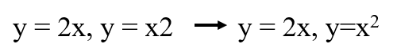

# RaspberryPi-For-Makers

오류 수정
----------------------------------

1장
----------------------------------
2장
----------------------------------
3장
----------------------------------
130페이지  
i2cdetect 0 -> i2cdetect -y 0 
i2cdetect 1 -> i2cdetect -y 1 

4장
----------------------------------
5장
----------------------------------
6장
300페이지  
 
 

----------------------------------
7장
----------------------------------
8장
----------------------------------
9장
----------------------------------
