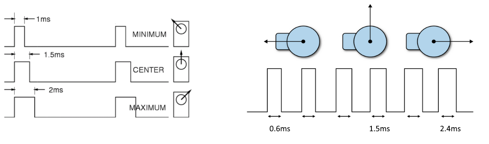

# RaspberryPi-For-Makers

오류 수정
----------------------------------

1장
----------------------------------
11페이지<br />
> ~~2017년 1월 현재 시점에서는 overclock을 지원하지 않는다.~~ <br /><br/>
 2017년 1월 현재 시점에서 파이3에서는 overclock을 지원하지 않는다. (파이 2에서는 지원)<br/>

2장
----------------------------------

3장
----------------------------------
130페이지 <br />
i2cdetect 0 -> i2cdetect -y 0<br/>
i2cdetect 1 -> i2cdetect -y 1<br/>

4장
----------------------------------
201페이지<br/>

> ~~대부분의 서보 모터는 PWM 펄스 주기와 듀티비를 이용해 회전 각도응 조절하게 설계되어있다.~~<br/><br/>
위 표현은 설명이 부족하다. PWM 펄스의 High 상태의 시간으로 조절한다는 표현이 더 정확하다. 물론 펄스 주기(Hz)와 듀티비를 조절하면 PWM 펄스의 High 상태 시간 조절이 가능하다. 많은 서보 모터들은 50Hz의 PWM을 사용한다. (하지만 반드시 50Hz일 이유는 없다.)  따라서 하나의 펄스 폭은 20ms가 되며  듀티비가 10%이면 2ms가 된다. 대부분의 서보는 1ms ~ 2ms 또는 0.5ms ~ 2.5ms에서 작동한다. 정확한 값은 데이터 시트 및 실험을 통해 확인한다. 


<br/><br/>205페이지<br/>
>~~SG90 데이터시트에는 50Hz의 PWM이 필요하며 1.5ms 펄스는 0도(중앙), 2ms 펄스는 90도까지, 0 ~ 1ms 펄스는 -90도로 변한다고 되어 있다.~~<br/><br/>
SG90 서보 모터의 회전각은 데이터 시트의 내용과는 달리 대략 0.6ms ~ 2.4ms 근처에서 정해진다.

 
<실제 펄스 시간에 따른 SG90 서보모터의 회전각>


#### 본문의 예제 코드는 새롭게 작성한 다음 코드를 참조한다.
SG90 서보 모터는 입문용으로 정밀한 제어가 불가능하다. 정확한 각도로 움직이지 않더라도 이상하게 생각할 필요 없다. 성능이 뛰어난 서보 모터를 사용하면 좀 더 정확한 제어가 가능하다. 
```python
#!/usr/bin/env python
#-*- coding: utf-8 -*-

import RPi.GPIO as GPIO
import sys
import time

# 하드웨어 PWM은 18번 핀을 이용해 제어한다.
pin = 18

# 임의의 입력 각도 만큼 SG90 모터를 회전시킨다.
# 0.6ms ~ 2.4ms (duty -> 3 ~ 12) JDX 서보 모터는 0.5 ~ 2.5ms에서 작동
def sg90_servo(angle):
    global pwm
    if(angle < 0 or angle > 180):
        print "invalid angle:", angle
        return
    dp = 3 + angle * 9.0 / 180.0
    pwm.ChangeDutyCycle(dp)


GPIO.setmode(GPIO.BCM)
GPIO.setup(pin, GPIO.OUT)
# 18번 핀을 H/W PWM(50Hz)으로 지정한다.
pwm = GPIO.PWM(pin, 50)

# 서보 모터를 중앙에 위치 시킴
pwm.start(7.5)

try:
    while True:
        # 임의의 회전각 입력 받음
        val = input("angle 0 ~ 180 or  -1 to quit:")
        angle = val
        if(-1 == angle):
            break
        # 회전각만큼 모터 회전 시킴
        sg90_servo(angle)

except KeyboardInterrupt:
    pwm.stop()			
    GPIO.cleanup()
```


<br/><br/>220 ~ 222페이지<br/>
201페이지 수정 내용을 반영해 소스코드의 서보모터 회전각 조절하는 부분을 수정한다.<br/>

#### 본문의 예제 코드는 새롭게 작성한 다음 코드를 참조한다. 전체 코드는 소스코드 부분을 참조한다.<br/>
수정전
```python
# PWM 듀티 설정
def set_PWM_Duty(channel, rate):
	on = 0
	off = rate * 4095.0 / 100.0 
	set_PWM(channel, on, int(off))

......(중략)......

try:
	while True:
		val = input("Duty: 0.0 ~ 100.0,  Ctrl+C to quit:")
		set_PWM_Duty(0, val)
		time.sleep(1)
except KeyboardInterrupt:   
	print "Servo driver Application End" 
	set_PWM(0, 0, 0)
	exit()            
```
 
수정 후
```python

```

<br/><br/>


5장
----------------------------------
238페이지 <br />
그림 5-17설명 위치가 테이블 내용과 겹치는 편집 오류<br />

6장
----------------------------------
300페이지 <br />
 
<br />

7장
----------------------------------
8장
----------------------------------
9장
----------------------------------
