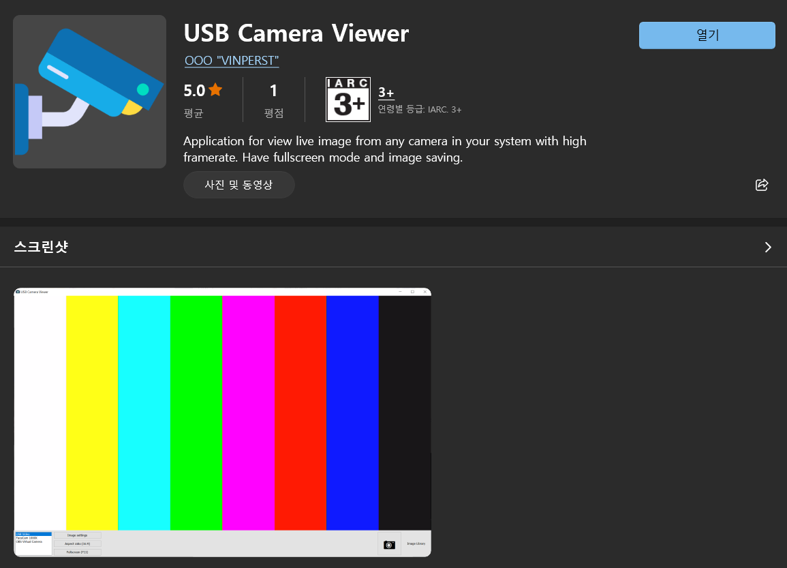
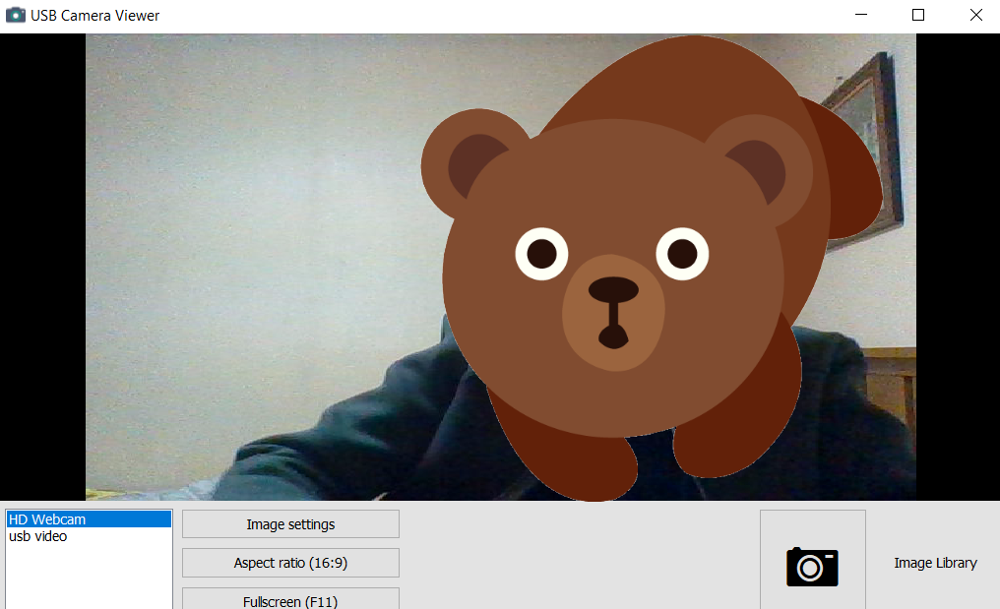
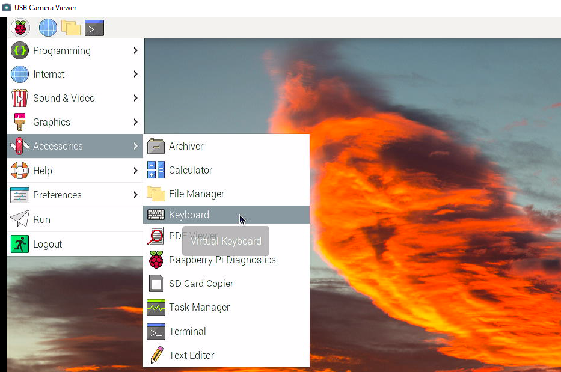
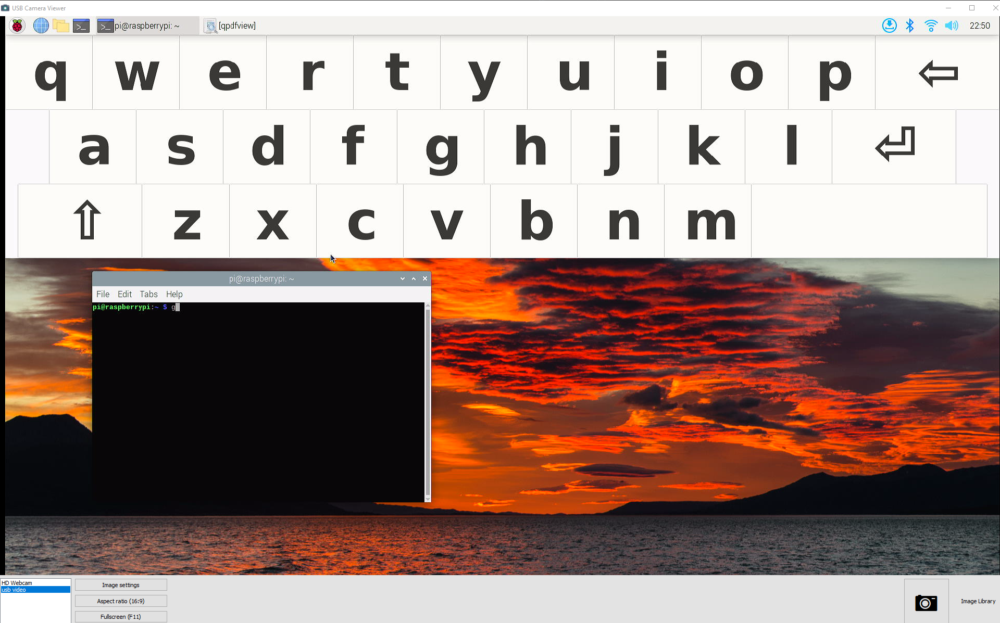
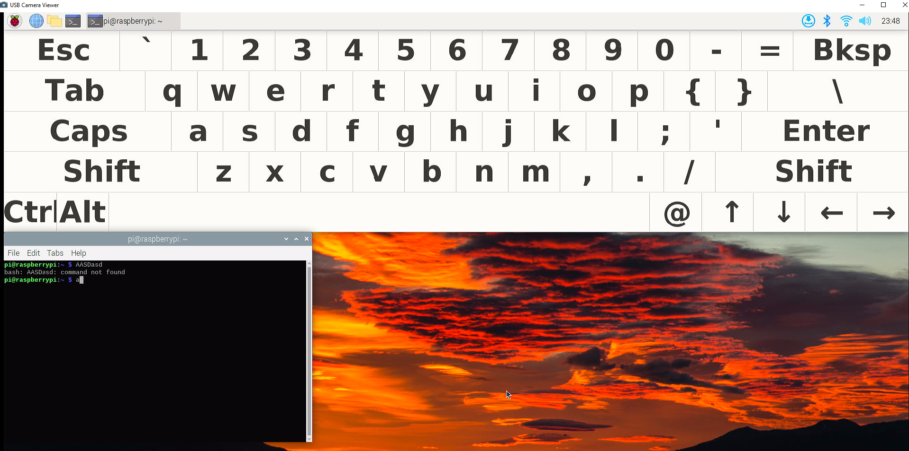

# 노트북 모니터를 라즈베리파이 모니터로 활용하기

노트북 모니터를 라즈베리파이의 모니터로 이용하려면 HDMI 캡쳐 USB 장비가 필요하다. 이 장비는 알리익스프레스에서 8 ~ 15$ 정도에 구매할 수 있다. 아주 유용하게 사용할 수 있는 장비이며 작고 저렴하기 때문에 하나 정도 구매하는 것도 나쁘지 않다. <br />


<br /><br />
나는 선이 있는 제품을 구매했는데 2 종류 제품 모두 사용하는데에는 문제 없다. 다만 제품에 따라 성능(해상도 및 FPS)에 차이가 있다. 만약 화면 출력을 동영상으로 저장하려한다면 성능도 잘 살펴서 적당한 제품을 선택하도록 한다.

이 제품은 HDMI 출력을 USB를 통해 입력한다. USB 웹캠과 비슷한 구조라고 생각하면 쉽다. USB 웹캠이 웹캠 카메라에 잡힌 영상을 USB를 통해 스트리밍 하듯이 이 제품은 HDMI를 통해 들어오는 영상을 USB를 통해 스트리밍한다. 따라서 사용법도 웹캠과 상당히 유사하다.
<br /><br />

## PC용 소프트웨어
여러가지 소프트웨어를 사용해서 HDMI 영상을 출력할 수 있다. 많이 사용하는 소프트웨어는 OBS 스튜디오이지만 마이크로소프트스토어에서 간단하게 설치해서 사용할 수 있는 소프트웨어를 발견했다. 이 프로그램의 이름은 USB Camera Viewer 이다.

나는 이 프로그램을 이용하도록 하겠다. 사용법도 아주 쉽다.<br /><br />


<br /><br />

## 연결
USB 캡쳐 장치를 먼저 USB 3.0포트에 연결한다. 반드시 전송속도가 좋은 USB 3.0에 연결한다. 아직 라즈베리파이의 전원은 켤 필요가 없다.
그리고 프로그램을 마이크로소프트스토어에서 설치한다. 설치 후 프로그램을 찾지 못하면 윈도우즈 화면 하단의 돋보기를 눌러 "USB Camera Viewer"로 검색하면 된다. 그리고 프로그램을 실행하면 다음 그림처럼 프로그램이 실행된다. 만약 웹캠 또는 카메라가 장착된 노트북을 사용한다면 이 장치를 먼저 연결해서 보여 줄 것이다. <br /><br />


<br /><br />


우측 하단에 보면 "usb video"가 보일 것이다. 이 장치가 USB 캡쳐 장치이다. 이 장치를 선택한다. 아마 검은 바탕화면에 아무것도 보이지 않을 것이다. 아직 HDMI를 통해 데이터가 들어오지 않기 때문에 검은 화면만 보인다. <br /><br />

이제 파이에 HDMI 케이블을 연결 후 부팅을 해보자. 다음 그림처럼 부팅화면부터 확인할 수 있다.<br /><br />

 <br /><br />
부팅이 끝나면 라즈베리파이 초기 화면이 나타난다. 이제 마우스, 키보드를 라즈베리파이에 연결해 작업을 하면 된다. <br /> <br />

<br /><br />

>⚠️ 처음에는 화면이 작고 글씨가 잘 보이지 않을 것이다. 모서리를 드래깅해서 화면 사이즈를 키우다 보면 글씨가 잘 보이는 크기가 될 것이다. 이 프로그램의 화면은 웹캠 화면처럼 하나의 이미지이며, 프로그램 창이 축소된 상태에서는 글씨가 잘 보이지 않는다. 실제 해상도 크기에 근접하면 글씨가 제대로 보일 것이다. 


# 가상 키보드 
태블릿 사용자들은 블루투스 키보드를 가지고 다니는 경우가 많기 때문에 라즈베리파이에 블루투스 키보드를 페어링해서 사용하면 되지만, 많은 분들이 노트북을 휴대할 때 마우스는 함께 가지고 다니지만 키보드는 특별한 이유가 없으면 가지고 다니지 않는다. 마우스 없이는 작업이 가능해도 키보드 없이는 할수 있는 일이 거의 없다. 블루투스 키보드를 가지고 있지 않다면 미리 라즈베리파이에 가상 키보드 프로그램을 설치해두면 응급시 HDMI 캡쳐카드와 함께 요긴하게 사용할 수 있다.  <br /><br />


## 가상 키보드 설치
미리 다음 소프트웨어들을 라즈베리파이에 설치해둔다.

``` bash
sudo apt update
sudo apt install matchbox-keyboard -y
```
그리고 시스템 재부팅하면 다음 그림과 같이 악세사리 메뉴에서 키보드가 추가된다.<br /><br />

<br /><br />

이제 터미널 또는 어플리케이션을 열어서 입력작업을 할 수 있다.<br /><br />
<br /><br />

그런데 키보드 레이아웃이 적절치 않다. 숫자키와 특수키가 전혀 보이지 않는다. 가장 무난한 텐키리스 모드로 미리 변환해둔다.
다음 xml 파일을 복사해서 ~/.matchbox/keyboard.xml에 저장한다.   <br /><br />
```xml
<?xml version="1.0" encoding="UTF-8"?>

<keyboard>

<options>
<!-- not yet implemented -->
</options>


<layout id="default keyboard">


  <row>

    <key fill="true">
          <default display="Esc" action="escape" />
    </key>
    <key>
	  <default display="`" />
	  <shifted display="~" />
    </key>
    <key>
	  <default display="1" />                
	  <shifted display="!" />
    </key>
    <key>
	  <default display="2" />                
	  <shifted display='@' />
          <mod1    display="½" />
    </key>
    <key>
	  <default display="3" />
	  <shifted display="#" />
          <mod1    display="¾" />               
    </key>
    <key>
	  <default display="4" />
	  <shifted display="$" />                
    </key>
    <key>
	  <default display="5" />
	  <shifted display="%" />                
    </key>
    <key>
	  <default display="6" />
	  <shifted display="^" />                
    </key>
    <key>
	  <default display="7" />
	  <shifted display="&amp;" />                
    </key>
    <key>
	  <default display="8" />
	  <shifted display="*" />                
    </key>
    <key>
	  <default display="9" />
	  <shifted display="(" />                
    </key>
    <key>
	  <default display="0" />
	  <shifted display=")" />                
    </key>
    <key>
	  <default display="-" />
	  <shifted display="_" />                
    </key>
    <key>
	  <default display="=" />
	  <shifted display="+" />                
    </key>

    <key fill="true">
         <default display="Bksp" action="backspace"/>
    </key>


  </row>
  <row>


    <key fill="true">
          <default display="Tab" action="tab"/>
    </key>
    <key obey-caps='true'>
	  <default display="q" />                
	  <shifted display="Q" />
    </key>
    <key obey-caps='true'>
	  <default display="w" />                
	  <shifted display="W" />
    </key>
    <key obey-caps='true'>
	  <default    display="e" />                
	  <shifted display="E" />
    </key>
    <key obey-caps='true'>
	  <default display="r" />                
	  <shifted display="R" />
    </key>
    <key obey-caps='true'>
	  <default display="t" />                
	  <shifted display="T" />
    </key>
    <key obey-caps='true'>
	  <default display="y" />                
	  <shifted display="Y" />
    </key>
    <key obey-caps='true'>
	  <default display="u" />                
	  <shifted display="U" />
    </key>
    <key obey-caps='true'>
	  <default display="i" />                
	  <shifted display="I" />
    </key>
    <key obey-caps='true'>
	  <default display="o" />                
	  <shifted display="O" />
    </key>
    <key obey-caps='true'>
	  <default display="p" />                
	  <shifted display="P" />
    </key>
    <key>
	  <default display="{" />                
	  <shifted display="[" />
    </key>
    <key>
	  <default display="}" />                
	  <shifted display="]" />
    </key>
    <key fill="true">
	  <default display="\" />                
	  <shifted display="|" />
    </key>

  </row>
  <row>


    <key fill="true">
	  <default display="Caps" action="modifier:caps"/>                
    </key>
    <key obey-caps='true'>
	  <default display="a" />                
	  <shifted display="A" />
    </key>
    <key obey-caps='true'>
	  <default display="s" />                
	  <shifted display="S" />
    </key>
    <key obey-caps='true'>
	  <default display="d" />                
	  <shifted display="D" />
    </key>
    <key obey-caps='true'>
	  <default display="f" />                
	  <shifted display="F" />
    </key>
    <key obey-caps='true'>
	  <default display="g" />                
	  <shifted display="G" />
    </key>
    <key obey-caps='true'>
	  <default display="h" />                
	  <shifted display="H" />
    </key>
    <key obey-caps='true'>
	  <default display="j" />                
	  <shifted display="J" />
    </key>
    <key obey-caps='true'>
	  <default display="k" />                
	  <shifted display="K" />
    </key>
    <key obey-caps='true'>
	  <default display="l" />                
	  <shifted display="L" />
    </key>
    <key>
	  <default display=";" />                
	  <shifted display=":" />
    </key>
    <key>
	  <default display="'" />                
	  <shifted display="&#34;" />
    </key>
    <key fill="true">
          <default display="Enter" action="return"/>
    </key>


  </row>
  <row>


    <key fill="true">
	  <default display="Shift" action="modifier:shift"/>                
    </key>

    <key obey-caps='true'>
	  <default display="z" />                
	  <shifted display="Z" />
    </key>

    <key obey-caps='true'>
	  <default display="x" />                
	  <shifted display="X" />
    </key>

    <key obey-caps='true'>
	  <default display="c" />                
	  <shifted display="C" />
    </key>

    <key obey-caps='true'>
	  <default display="v" />                
	  <shifted display="V" />
    </key>

    <key obey-caps='true'>
	  <default display="b" />                
	  <shifted display="B" />
    </key>

    <key obey-caps='true'>
	  <default display="n" />                
	  <shifted display="N" />
    </key>

    <key obey-caps='true'>
	  <default display="m" />                
	  <shifted display="M" />
    </key>

    <key>
	  <default display="," />                
	  <shifted display="&lt;" />
    </key>
    <key>
	  <default display="." />                
	  <shifted display="&gt;" />
    </key>
    <key>
	  <default display="/" />                
	  <shifted display="?" />
    </key>


    <key fill="true">
	  <default display="Shift" action="modifier:shift"/>                
    </key>


 </row>
  <row>

<!--
    <key>
	  <default display="Func" action="modifier:mod1"/>                
    </key>
-->

    <key fill="true">
	  <default display="Ctrl" action="modifier:ctrl"/>                
    </key>

    <key>
	  <default display="Alt" action="modifier:alt"/>                
    </key>


    <key width="12000">
	  <default display=" " action="space" />                
    </key>

    <key>
	  <default display="@" />                
	  <shifted display="'" />
    </key>

    <key>
	  <default display="↑" action="up" />                
    </key>
    <key>
	  <default display="↓" action="down" />                
    </key>
    <key>
	  <default display="←" action="left" />                
    </key>
    <key>
	  <default display="→" action="right" />                
    </key>
</row>
</layout>
</keyboard>

```


<br /><br />

그리고 다시 키보드 프로그램을 실행한다. 이제 다음과 같이 보일 것이다. 훨씬 작업하기 편리하다. 위 xml에서 알 수 있듯이 상당히 직관적으로 다양한 키보드 설정을 할 수 있다. 구글에서 "matchbox-keyboard layout"로 검색하면 다양한 레이아웃 파일과 xml 설정 방법을 찾을 수 있다.
<br /><br />

<br /><br />

## 마무리
vnc와 같은 원격접속 프로그램처럼 원격 작업에 최적호된 프로그램이 아니기 때문에 마우스 반응 속도 또는 화면 글씨가 아주 만족스럽지는 않다. 하지만 모니터가 없는 외부에서 급하게 노트북을 연결해서 사용해서 급하게 작업이 필요한 경우 아주 유용하게 사용할 수 있다.
이 글에서 소개한 HDMI 캡쳐카드는 라즈베리파이 녹화 또는 화면 캡쳐 용도로도 아주 유용하다. 특히 초기 부팅화면부터 녹화를 할 수 있는 장점도 있다. 앞글에서 소개한 USB TTL 케이블과 함께 유용하게 사용할 수 있는 제품이다. 파이 뿐 아니라 PS3, XBox 등의 게임기를 비롯해 HDMI로 출력되는 다양한 영상을 처리할 수 있다. 
키보드, 모니터, 네트워크가 불가능한 응급 상황에서 사용할 수 있는 소프트 키보드와 HDMI 캡쳐 카드에 대한 소개를 마친다. 

