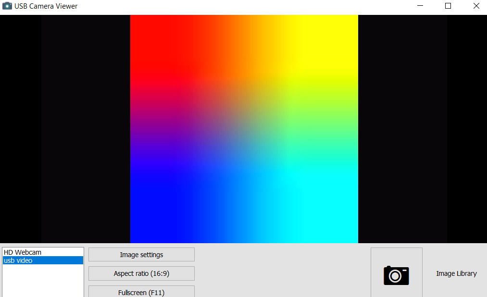
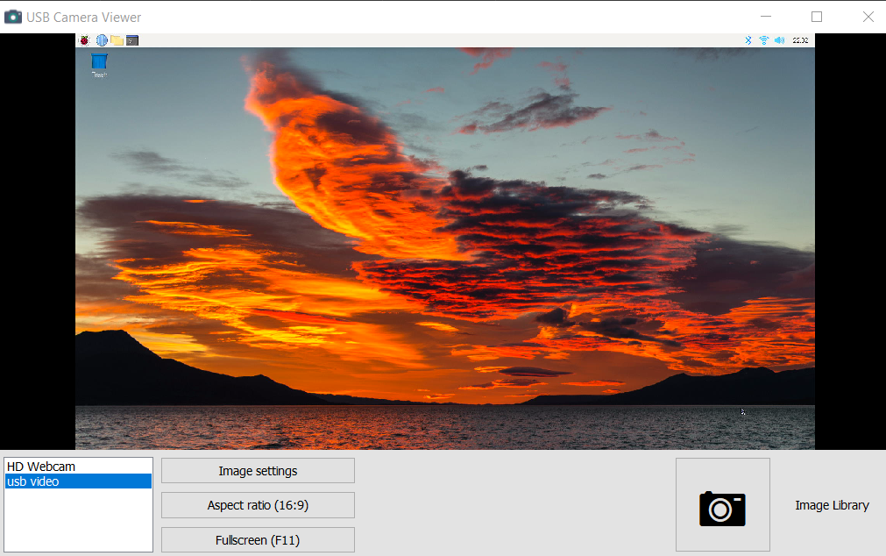

# 노트북 모니터를 라즈베리파이 모니터로 활용하기

노트북 모니터를 라즈베리파이의 모니터로 이용하려면 HDMI 캡쳐 USB 장비가 필요하다. 이 장비는 알리익스프레스에서 8 ~ 15$ 정도에 구매할 수 있다. 아주 유용하게 사용할 수 있는 장비이며 작고 저렴하기 때문에 하나 정도 구매하는 것도 나쁘지 않다.  

  
나는 선이 있는 제품을 구매했는데 2 종류 제품 모두 사용하는데에는 문제 없다. 다만 제품에 따라 성능(해상도 및 FPS)에 차이가 있다. 만약 화면 출력을 동영상으로 저장하려한다면 성능도 잘 살펴서 적당한 제품을 선택하도록 한다.

이 제품은 HDMI 출력을 USB를 통해 입력한다. USB 웹캠과 비슷한 구조라고 생각하면 쉽다. USB 웹캠이 웹캠 카메라에 잡힌 영상을 USB를 통해 스트리밍 하듯이 이 제품은 HDMI를 통해 들어오는 영상을 USB를 통해 스트리밍한다. 따라서 사용법도 웹캠과 상당히 유사하다.
  

## PC용 소프트웨어
여러가지 소프트웨어를 사용해서 HDMI 영상을 출력할 수 있다. 많이 사용하는 소프트웨어는 OBS 스튜디오이다. 하지만 내 PC에 설치되어 있는 VLC 미디어 재생기로도 화면 출력이 가능하다. 나는 VLC 미디어 재생기를 이용하도록 하겠다.   

## 연결
먼저 VLC 미디어 재생기를 실행한다. 그리고 HDMI 캡쳐카드를 노트북의 USB 3.0 포트에 연결한다. 이 제품은 영상데이터의 고속 전송을 위해 USB 3.0을 사용한다. 라즈베리 파이는 아직 연결하지 않아도 된다. 반드시 VLC를 먼저 실행하도록 한다. 그 이유는 VLC가 실행되면서 검색한 디바이스만 보여주는 것 같기 때문이다. VLC의 미디어 -> 스트림하기로 이동한다. 그리고 캡쳐장치 탭에서 다음과 같이 usb video가 보일 것이다.(제품에 따라서 이 이름은 바뀔 수 있다.) 오디오는 큰 의미가 없지만 파이의 오디오 출력을 HDMI로 한다면 오디오까지 출력할 수 있다. 그리고 해상도는 1024 X 768로 지정했다. 그리고 아래 스트림 버튼에서 화살표를 눌러 재생을 선택한다.   

  
그러면 잠시 후 아듬과 같이 1024 X 768 사이즈의 검은 창이 나타난다. 아직 HDMI를 통해 데이터가 들어오지 않기 때문에 검은 화면만 보인다.   

  

이제 파이에 HDMI 케이블을 연결 후 부팅을 해보자. 다음 그림처럼 부팅화면부터 확인할 수 있다.  

   
부팅이 끝나면 라즈베리파이 초기 화면이 나타난다. 이제 마우스, 키보드를 라즈베리파이에 연결해 작업을 하면 된다.    

  
## 마무리

이 글에서 소개한 HDMI 캡쳐카드는 라즈베리파이 녹화 또는 화면 캡쳐 용도로도 아주 유용하다. 특히 초기 부팅화면부터 녹화를 할 수 있는 장점도 있다. 앞글에서 소개한 USB TTL 케이블과 함께 유용하게 사용할 수 있는 제품이다. 파이 뿐 아니라 PS3, XBox 등의 게임기를 비롯해 HDMI로 출력되는 다양한 영상을 처리할 수 있다. 

