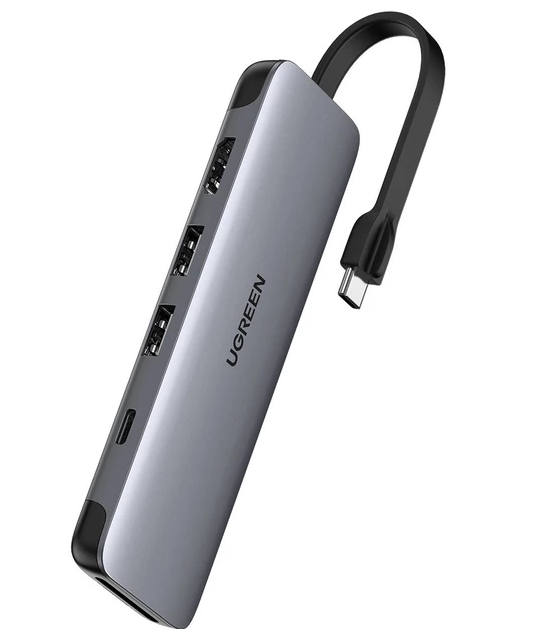

# 스마트폰을 라즈베리파이 모니터로 활용하기
노트북을 이용할 때와 마찬가지로 스마트폰 라즈베리파이의 모니터로 이용하려면 HDMI 캡쳐 USB 장비가 필요하다. 이 장비는 알리익스프레스에서 8 ~ 15$ 정도에 구매할 수 있다. 아주 유용하게 사용할 수 있는 장비이며 작고 저렴하기 때문에 하나 정도 구매하는 것도 나쁘지 않다. 기본적인 사용법은 노트북을 사용할 때와 동일하다. 

  
이 제품은 HDMI 출력을 USB를 통해 입력한다. USB 웹캠과 비슷한 구조라고 생각하면 쉽다. USB 웹캠이 웹캠 카메라에 잡힌 영상을 USB를 통해 스트리밍 하듯이 이 제품은 HDMI를 통해 들어오는 영상을 USB를 통해 스트리밍한다. 따라서 사용법도 웹캠과 상당히 유사하다.
위 그림에서 스틱형 제품인 경우 출력 USB가 Type C가 아니다. 가능하면 USB C타입 출력 제품을 구매하는 것이 좋지만 만약 C 타입 제품이 아니라면 다음 그림처럼 USB 젠더를 사용할 수 있다.  

  
위 그림처럼 USB 허브를 이용해서 스마트폰에 연결한다. 테스트에는 갤럭시 S10을 사용했다.
  

## 스마트폰용 소프트웨어
구글플레이에서 USB 카메라로 검색하면 몇개의 앱을 찾을 수 있다. 나는 아래 그림의 앱을 설치해서 사용했다. 노트북에서는 vlc 플레이어를 사용했지만 스마트폰용 VLC 플레이어는 USB를 통한 스트리밍을 지원하는 기능을 찾지 못했다. 따라서 USB카메라를 연결할 수 있는 앱을 사용했다.   

  

## 연결
앱을 실행한 다음 USB 케이블을 연결하면 다음과 같이 권한을 요청한다. 
  

 

  

이제 다음과 같이 라즈베리파이 화면을 스마트폰에서 확인할 수 있다. 

  

## 마무리
스마트폰은 화면이 작아서 작업 환경이 좋지는 않지만 응급 상황에서 요긴하게 사용할 수 있다. 

>⚠️한가지 주의할 점은 HDMI 캡쳐카드의 전원을 USB C 단자를 통해 스마트폰에서 공급받기 때문에 스마트폰 배터리 소모량이 많다. 스마트폰 보조 밧데리 사용을 추천한다.

