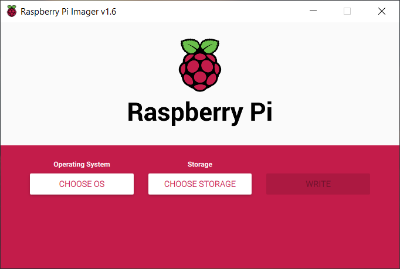
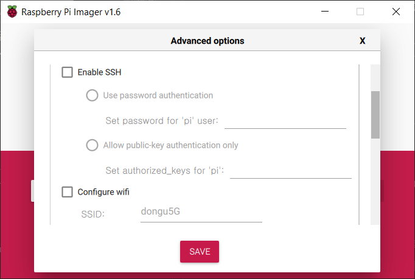
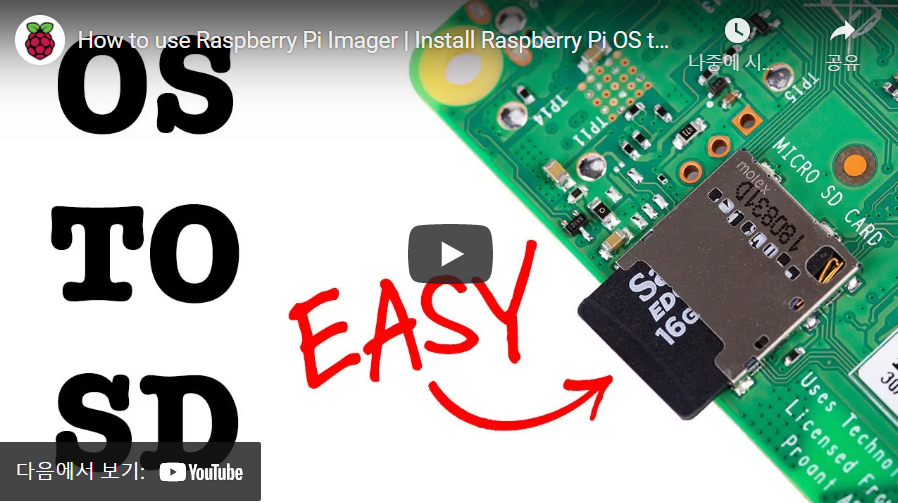

# Raspberry Pi Imager를 이용한 헤더리스 이미지 만들기
라즈베리파이 재단에서는 라즈베리파이 OS이미지를 만들 수 있는 Raspberry Pi Imager를 2020년 공개했다. 이 프로그램은 SD카드 이미지를 만들때 많이 사용했던 Etcher 또는 WIn32DiskImager와 큰 차이가 없었다. 사실 Raspberry Pi Imager는  [PiBakery](https://www.pibakery.org/)를 이용해 만든 제품이다. 이 제품의 사용법은 [헤드리스 셋업PiBakery](https://github.com/raspberry-pi-maker/RaspberryPi-For-Makers/blob/master/tips/chap-01/headless_setup.md)에서 설명했다. 
그런데 2021년 3월에 발표된 1.6버젼은 헤드리스 셋업에 상당히 유용한 기능을 포함하고 있다. 더 이상 PiBakery를 사용할 필요가 없는 것 같다.
우선 [Raspberry Pi OS 사이트](https://www.raspberrypi.org/software/)에서 Raspberry Pi Imager 프로그램을 다운로드 받는다.    

## 헤드리스 셋업을 위한 Pi Imager의 간단한 사용법
먼저 설치한 Pi Imager를 실행한다.  
  

먼저 Operating System을 선택한다. 목록에서 선택하면 온라인으로 다운로드 받기 때문에 시간이 걸릴 수 있다. 만약 미리 다운로드 받은 파일이 있으면 아래 부분의 "use custom"울 선택하면 로컬 저장소의 이미지 파일을 이용하기 때문에 빨리 이미지를 만들 수 있다.

### Ctrl-Shift-X를 이용한 고급 옵션 선택
헤드리스 셋업을 위한 메뉴는 숨겨져 있다. Ctrl-Shift-X를 누르면 다음과 같은 고급 옵션이 나타난다.
  

#### SSH 활성화
여기에서 SSH를 활성화시킨다. 처음 접속이기 때문에 키 방식이 아닌 password authentication 방식을 사용하도록 한다. 

#### WiFi 활성화
LAN을 이용할 것이면 여기까지만 진행해도 된다. 만약 WiFi를 이용할 예정이면 다음 항목인 Configure Wifi를 체크하고 SSID와 공유기 접속 암호를 넣는다.

#### Locale 설정
현재 사용자 위치를 찾아서 기본 로케일을 제공해주는데 한국에서는 키보드 옵션이 US가 기본인 것이 너무 반갑다. 항상 로케일 및 키보드 배열을 새롭게 지정해야 하는 것이 번거로웠는데 영국 연방이 아니면 US 값을 기본으로 제공하는 듯 하다.

### Storage 설정
그리고 "CHOOSE STORAGE"에서 sd카드를 삽입한 디바이스를 선택한다.  

여기까지 문제 없으면 WRITE 버튼이 활성화된다. 이제 WRITE버튼을 눌러 이미지를 만든다. 그리고 만든 이미지를 이용해 파이을 부팅한 다음 IP Scan 툴을 이용해 Pi 주소를 확인하고 ssh로 접속한다.
라즈베리파이 재단에서 만든 동영상에 자세한 설명이 있다.  
 