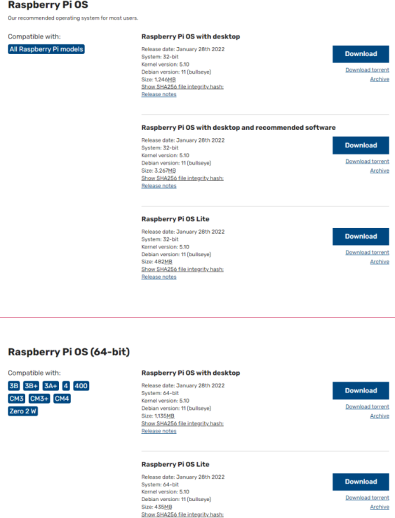
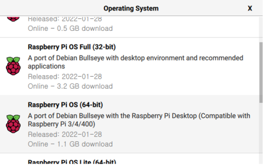
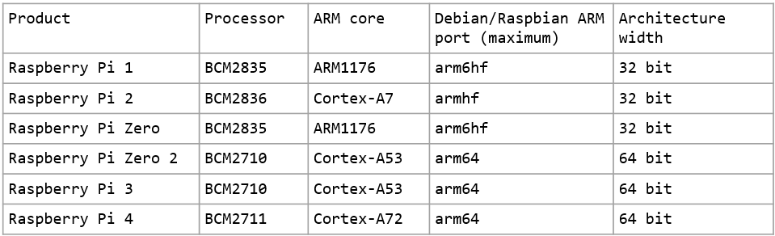
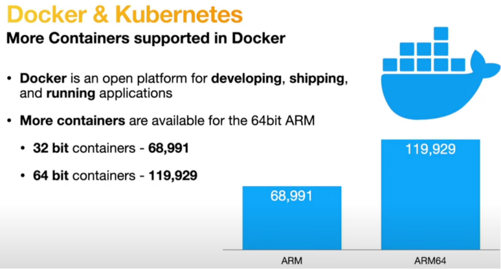
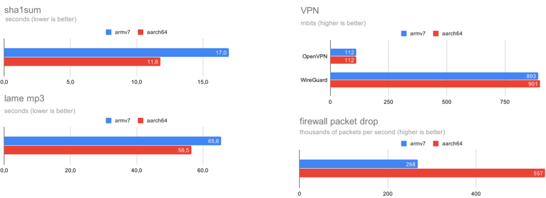
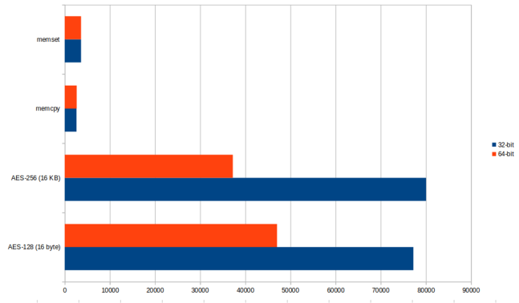
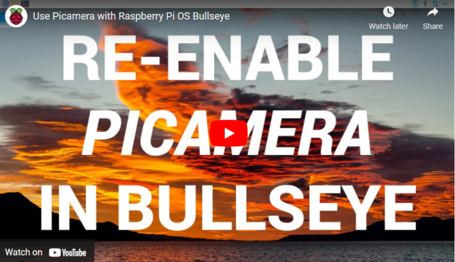
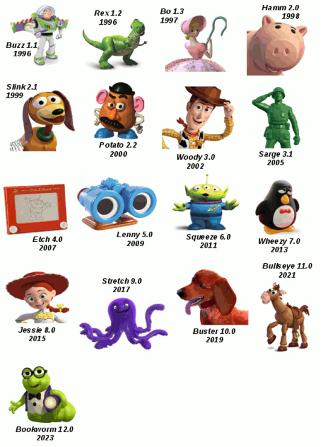

드디어 2022년 2월 2일 라즈베리파이 재단에서 Raspberry Pi OS(64-bit)의 정식 버젼을 공개했습니다.
64bit OS의 베타버젼이 2020년 5월에 공개돤 시점으로부터 1년 이상의 시간이 흘렀습니다. 그만큼 64비트 버전 안정화에 많은 어려움이 있었다는 것을 의미하는 것 같습니다. 

이제 라즈베리파이 재단 홈페이지의 OS 다운로드 페이지에도 64비트 OS가 당당히 공개되었습니다. 참고로 이전 베타버젼은 홈페이지에 노출되지 않았습니다.

 
<홈페이지에 공개된 64비트 OS>  

또한 이미지 다운로드 및 SD카드 이미지를 만을 수 있는 도구 Rasapberry Pi Imager 에서도  32비트 OS가 최상단에 나타나지만 이제 64비트 OS를 쉽게 찾아서 설치할 수 있습니다. 

 
<Raspberry Pi  Imager의 64비트 OS 옵션>  

64비트 OS는 Pi3, Pi4 그리고CM3, CM4, Zero 2W모델과 같은 비교적 최근에 출시된 제품에서만 사용 가능합다. 그 이유는AArch-64기반의  64비트ARM CPU를 사용하는 라즈베리파이 모델에서만 64비트 OS가 사용가능하기 때문입니다.
다음 표는 라즈베리파이 모델별로 사용하는 CPU를 정리한 표입니다. CM시리즈는 제외했습니다. 표에서 알 수 있듯이 라즈베리파이  3,4 그리고 Zero2에서만 64비트 OS를 사용할 수 있습니다.

 
<Raspberry Pi 모델별 CPU>

그럼 라즈베리파이 OS 64비트의 특징에 대해서 살펴보겠습니다.  

# 메모리

만약 4GB 이하의 메모리를 가진 파이 모델을 사용한다면 메모리 사용과 관련해서 32비트와 64비트는 큰 차이가 없습니다. 하지만 Rpi4 8GB 메모리 모델 또는 향후 출시될 모델들 중 8GB이상의 메모리를 탑재한 모델을 사용할 계획이라면 OS에 따른 메모리 사용을 알아두는 것이 좋습니다.

32비트 OS에서는  원칙적으로 4GB메모리 이상을 사용할 수 없습니다. 그 이유는 32비트에 저장할 수 있는 정수값의 범위가 0부터 4,294,967,295 까지이기 때문입니다. 이 한계는 라즈베리파이 OS 뿐 아니라 윈도우즈를 비롯한 모든 OS에 공통으로 적용되는 제약 사항입니다. 

위에서 원칙적이라고 표현한 이유는 이러한 한계를 벗어나기 위해 32비트 OS들은 약간의 트릭을 사용합나다.  라즈베리파이 OS를 포함한 ARM CPU에서 작동하는 32비트 리눅스들은 LPAE(Large Physical Address Extension)라 불리는 방법을 사용하는데  이 방법을 사용하면 4 GB 이상의 메모리 어드레싱이 가능해집니다.
하지만 여기에는 큰 약점이 존재합니다. 시스템 전체로는 4GB  이상의 메모리 사용이 가능하지만 프로세스 단위로는 32비트 한계를 벗어나지 못하기 때문에 프로세스 당 4GB의 메모리 한계가 존재합니다. 그리고 이 중 1GB는 커널에 할당되기 때문에 실제 프로세스가 사용가능한 메모리는 3 GB  이내입니다.

이런 한계점은 사용자에 따라서 문제가 될 수도 안될 수도 있습니다. 많은 메모리를 필요로하는 머신러닝 프로그램, 데이터베이스 서버를 구동하는 것이 목적이라면 32비트 OS의 이러한 약점은 문제가 될 것이지만 가벼운 프로그램 위주로 구동한다면 32비트 OS도 문제가 되지는 않을 것입니다.

그리고 64비트 OS에서는 메모리 사용량이 조금 더 늘어납니다. 가장 큰 이유는 메모리 관리를 위한 변수가 32비트에서 64비트로 바뀌기 떄문에 이들  변수들이 차지하는 메모리 값이 2배로 늘어나기 때문입니다. 
만약 512MB의 Zero 2에서 Raspberry Pi OS Lite 버전의 32비트, 64비트 버전을 설치한다면 48MB, 66MB의 메모리를  OS가 차지하고 있는 것을 확인할 수 있을 것습니다.  하지만 큰 차이는 아닙니다. 이러한 차이 때문에 64비트 OS를 사용하지 못할 이유는 전혀 없습니다.

  

# Modern OS

향후 64비트 OS에 관심을 가져야 하는 가장 큰 이유는 SW 호환성 때문입니다. 현재 대부분의 주류 OS들은 64비트이며 수많은 소프트웨어 패키지들 역시 이들 64비트  OS용으로 만들어집니다. 32비트 호환 버전을 지원하더라도 추후 어느 시점에는 지원이 중단될 가능성이 아주 높습니다. 그리고 OS 역시 32비트 OS은 더 이상 새로운 업그레이드를 제공하지 않는 방향으로 가고 있습니다.  라즈베리파이 OS가 사용하느 데비안은 아직은 32비트 OS를 지원하지만 분명히 미래 어느 시점에는 지원을 중단하게 될 것입니다. 아마 예를 들어 검색엔진 elasticsearch는 더 이상 32비트 Pi OS를 지원하지 않습니다. 따라서 최신 소프트웨어를 많이 사용하는 사용자들은 64비트 OS에 더 많은 관심을 가지는 것이 바람직합니다.

최근에는 대부분의 소프트웨어들이 도커 환경에서 마이크로서비스를 제공할 수 있도록 도커 이미지를 제공합니다. 아래 그림은 ARM 기반의 도커 이미지 개수를 비교한 그림입니다. ARM64에서 제공하는 도커 이미지 개수가 약 2배 가량 됩니다. 대부분의 최신 SW들이 64비트 버전을 타겟으로 개발 업데이트되기 때문에 아마 앞으로 이 차이는 더 벌어질 가능성이 높습니다. 64비트 OS로 옮겨가야 하는 근거들이 늘어나는 느낌입니다.

 
<ARM 32비트, 64비트 OS를 지원하는 도커 갯수>  

# 성능

그리고 64비트 OS는 64비트 CPU에서만 사용가능한 최신 명령어들을 사용할 수 있기 때문에 많은 경우 같은 프로그램을 실행하더라도 32비트 OS에 보다 어느정도 성능 향상을 기대할 수 있습니다. 다음은 몇가지 항목에 대한 성능 비교입니다.

 
<ARM 32비트, 64비트 OS의 성능 비교>  

아래 그림에서는 암호화 관련해서는 32비트가 더 좋은 성능을 나타냅니. 그 이유는 AA64 아키텍쳐에서 추가된 암호화 명령어셋이 라즈베리파이 4의 BCM2711 SOC에는 아직 지원하지 않기 때문인 것 같습니다.  이 부분은 향후 라즈베리파이 재단에서 사용하는 브로드컴의 BCMXXXX SOC이 개선되면서 추가될 가능성이 높습니다.

 
<Higher is better – memset/memcpy in MB/s, AES in KB/s>  

위 비교 자료는 https://www.cnx-software.com/2020/01/29/raspberry-pi-4-benchmarked-with-32-bit-and-64-bit-debian-os/ 에서 가져왔습니다.
32비트, 64비트 라즈베리파이 OS의 성능 비교에 관심이 많은 분들은 https://openbenchmarking.org/result/2202058-NE-RASPBERRY79&sgm=1& 페이지를 방문해보세요. 이 페이지에는 다양한 벤치마크 테스트를 라즈베리파이 OS 32비트 , 64비트 버전을 대상으로 진행한 자료들이 있습니다.  

# 약점

정식버젼이 나왔지만 아직 약간의 부족한 부분들도 있습니다. 
예들 들어 64비트 크로미엄 브라우저(오픈소스 크롬)가 Widevine DRM 호환성이 없어서 Pi OS 64 비트에서 넷플릭스, 디즈니+를 시청하는데 어려움이 있습니다.  이 문제는 수작업으로 32비트 크로미엄으로 설치를 변경하면 해결 가능합니다. https://www.raspberrypi.com/news/raspberry-pi-os-64-bit/ 에서 설치 방법을 찾을 수 있습니다.
그리고 하드웨어 비디오 가속 기능에 일부 문제가 있다는 보고도 있습니다. 하지만 이런 부분들은 추후 분명히 해결될 것입니다. 그리고 개인적으로는 라즈베리파이를 데스크톱으로 사용하지 않기 때문에 이런 문제들은 저에게는 선택의 제약 사항이 전혀 아닙니다.   

## 주의 - 카메라
만약 여러분이 라즈베리파이 OS를 64비트로 업그레이드하기로 마음먹었다면 한가지를 반드시 확인해야 합니다. 여러분의 라즈베리파이 시스템이 직접 개발한 프로그램을 이용해 카메라를 제어한다면 다음을 확인해야 합니다. 이것은 사실 32비트 64비트의 문제는 아닙니다. 라즈베리파이 OS는 2년 주기로 업데이트되는 데비안 OS를 기본으로 하고 있습니다. 데비안이 Buster에서 Bullseye로 업그레이드되면서 라즈베리파이 OS 역시 2021년 11월 Bullseye로 업그레이드되었습니다. 2021년 공개된 Bullseye 라즈베리파이 OS는 공식적으로 32비트 버젼입니다. 이 버젼부터 카메라 제어 부분이 많이 바뀌었습니다. 가장 큰 변화는 기존에 사용하던 Picamera 파이썬 라이브러리를 더 이상 사용할 수 없으며 Raspicam명령어들인  raspistill, raspivid, raspiyuv와 같은 카메라 제어 프로그램도 더 이상 사용할 수 없다는 것입니다. 이 명령어들은 Bullseye에서 livcamera-apps 명령어인 libcamera-hello, libcamera-jpeg,  libcamera-still, libcamera-vid, libcamera-raw 등으로 대체되었습니다. 따라서 Buster 기반 32비트 라즈베리파이 OS에서 카메라를 제어하는 프로그램을 사용하는 사용자 또는 시스템 개발자라면 반드시 카메라 기능을 확인 후 호환 여부 확인 및 필요시 업데이트 작업을 끝낸 다음 64비트 OS로 변경해야 합니다. 

라즈베리파이 재단에서는 Bullseye에서의 카메라 호환을 위해 PiCamera를 다시 사용할 수 있는 옵션을 제공하고 있습니다. 아래 비디오에서 PiCamera를 복원하는 방법을 설명합니다. 한가지 주의할 것은 이 옵션은 적용하기 전에 반드시 이미지를 백업해두시기 바랍니다. 레거시 모드로 전환하면 브로드컴 Soc용으로 개발된 카메라 스택이 사용되며 Bullseye에 새롭게 설치된 libcamera 스택을 사용하는 모드로 복원이 안됩니다. 단순히 파이썬 패키지를 바꾸는 작업이 아닌 것입니다. 

<레거시 카메라 복원 https://youtu.be/E7KPSc_Xr24 >  

개인적으로 이런 주먹구구식의 업데이트는 좋아하지 않습니다. 데비안 Bullseye로 업그레이드하면서 카메라 제어용 파이썬 패키지도 준비하지 않은 상태에서 너무 성급하게 카메라 구조를 바꾸었기 때문에 많은 항의와 기존 버젼 호환성을 요구하는 사용자들이 많았을 것입니다. 현재 파이썬용 PiCamera2 패키지가 개발중에 있습니다. 이 패키지는 기존의 PiCamera와는 근본적으로 다릅니다. 기존 PiCamera 패키지는 3rd Party에 의해 개발되었으며 리눅스 오픈소스 libcamera에 기반한 것이 아니라 브로드컴의 BCM SOC에 맞게 개발되었습니다. 따라서 라즈베리파이 재단에서 카메라 제어를 리눅스 오픈소스 진영의 libcamera를 기반으로 사용하려면 PiCamera 패키지의 수많은 부분을 새롭게 만들어야 합니다. 깃허브(https://github.com/raspberrypi/picamera2)에서 현재(2022.03)까지 개발된 picamera2 베타 버젼을 다운로드 받아서 테스트해볼 수 있습니다. 조만간 정식 버젼이 공개되면 라즈베리파이 재단 홈페이지에서 소개할 것입니다. 그때 까지는 PiCamera 패키지 사용에 불편함을 감수해야 할 것입니다.  
카메라 관련 개발패키지 문제는 PiCamera 뿐이 아닙니다. 카메라, 비디오 제어를 위해 가장 많이 사용하는 OpenCV 패키지 역시 문제가 발생합니다. 따라서 비디오, 카메라 관련해서 기존 솔루션이 64비트 버젼을 포함한 BullsEye에서 제대로 작동하지 않는다면 ㅣlibcamera 대신 Legacy Camera를 활성화해서 카메라 관련해서 기존 버젼으로 복원해야 할 수 있습니다.     

참고로 Buster, Bullseye  등의 이름은 애니메이션 토이스토리의 캐릭터에서 가져온 이름입니다. 지난 시간 데비안 OS의 변천사를 알아볼까요.  

 
<데비안 OS 이름과 토이스토리 등장 캐릭터>  

# 결론
라즈베리 파이 재단에서는 대부분의 구형 라즈베리파이 모델에 대한 지원을 2026년까지 약속하고 있기 때문에 32비트 OS 역시 2026년까지 지원할 것입니다. 하지만  앞으로 출시되는 라즈베리파이 모델은 64비트 CPU 일 것이고 라즈베리파이 생태계 역시 64비트 중심으로 옮겨갈 것입니다.
따라서 라즈베리파이3 이후 제품을 이용한 새로운 프로젝트를 준비한다면 특별한 이유가 없는 이상 64비트 OS에서 시작하는 것이 좋습니다. 