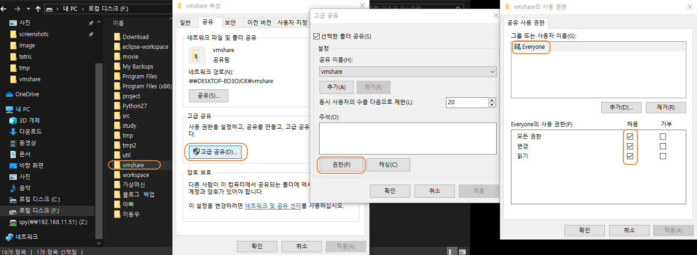
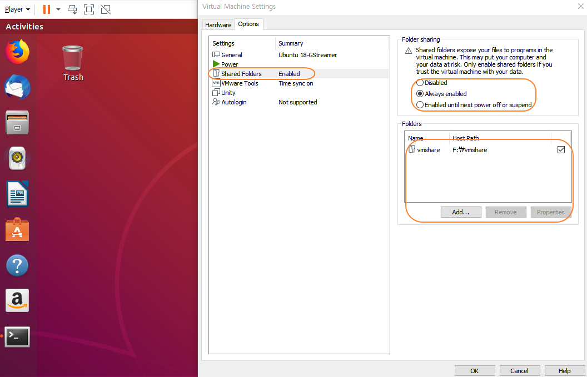

# SD카드 백업 이미지 사이즈 변경

백업 이미지의 두번째 파티션이 리눅스 파일 시스템이기 때문에 리눅스 시스템이 필요합니다. 가장 쉬운 방법은  PC에 무료 버젼인 VMPlayer를 설치해서 우분투 등의 리눅스 시스템을 설치하거나 또하나의 라즈베리파이를 이용하는 것입니다. 이 글에서는 PC를 이용하도록 하겠습니다. VMWare의 VMPlayer 설치 및 우분투 설치는 구글링을 통해 많은 에제를 찾을 수 있기 때문에 생략하겠습니다. VMPlayer 대신 오라클의 VirtualBox를  비롯한 다른 가상화 소프트웨어를 사용해도 됩니다. 참고로 테스트에는 우분투 18.04LTS 버젼을 사용했습니다.


# VMPlayer 이용
## 공유 폴더 생성

우분투에서 img 파일에 접근할 수 있도록 준비합니다. 방법은 img 파일이 저장된 외부 저장 장치의 제어권을 가상화 OS인 우분투에게 넘겨서 작업하는 것이 있고 다른 하나는 img 파일이 저장된 PC의 디렉토리를 공유해서 사용하는 방법이 있습니다. 여기에서는 후자를 이용해 보도록 하겠습니다. 중요한 것은 나중에 우분투에서 img 파일에 접근하는 것이기 때문에 어떤 방법을 사용하더라도 무방합니다. 
다음 그림처럼 img 파일이 저장된 폴더를 우클릭 후 모든 사용자에게 모든 권한을 부여합니다.


그리고 VMPlayer에서 설치한 우분투 리눅스를 실행한 다음, 상단 메뉴에서 Players->Manage->Edit virtual machine settings 메뉴를 이용해 다음과 같이 앞에서 공유한 PC 디렉토리를 공유합니다.


## 공유 폴더 접근
방금 VMPlayer에서 설정한 공유 폴더는 다음과 같이 우분투에서 "/mnt/hgfs/공유디렉토리 이름"으로 접근이 가능합니다.<br/>


``` bash
spypiggy@ubuntu:~$ ls -al /mnt
total 13
drwxr-xr-x  3 root root 4096 Jul 18  2019 .
drwxr-xr-x 24 root root 4096 Mar  6  2019 ..
dr-xr-xr-x  1 root root 4192 May 22 17:44 hgfs
spypiggy@ubuntu:~$ ls -al /mnt/hgfs
total 9
dr-xr-xr-x 1 root root 4192 May 22 17:44 .
drwxr-xr-x 3 root root 4096 Jul 18  2019 ..
drwxrwxrwx 1 root root    0 May 22 17:23 vmshare
spypiggy@ubuntu:~$ ls -al /mnt/hgfs/vmshare
total 3955559
drwxrwxrwx 1 root root          0 May 22 17:23 .
dr-xr-xr-x 1 root root       4192 May 22 17:45 ..
-rwxrwxrwx 1 root root        9831 May 21 06:12 pishrink.sh
-rwxrwxrwx 1 root root 15931539456 Jan 29 06:04 raspberry-rgb-matrix.img
```

이제 모든 준비가 끝났습니다. 이미지 변경작업을 해보도록 하겠습니다.
참고로 shrink.sh 파일은 Drew Bonasera씨가 만들었으며 https://github.com/Drewsif/PiShrink 에서 다운받을 수 있습니다.


## 이미지 변경 작업
작업은 스크립트 파일을 실행하는 것만으로 끝입니다. root 권한이 필요하기 때문에 반드시 sudo 명령을 함께 사용합니다. 두번째 파라미터 raspberry-rgb-matri2x.img는 생략 가능합니다. 만약 생략하면 첫번째 이미지를 덮어씁니다. 따라서 이미지의 백업을 따로 저장하지 않았다면 두번째 파라미터를 함께 사용하는 것이 안전합니다.

``` bash
spypiggy@ubuntu:/mnt/hgfs/vmshare$sudo bash ./pishrink.sh raspberry-rgb-matrix.img raspberry-rgb-matri2x.img
```

또는 pishrink.sh 파일에 실행권한을 부여 후 직접 실행합니다. 
``` bash
spypiggy@ubuntu:/mnt/hgfs/vmshare$sudo chmod +x pishrink.sh
spypiggy@ubuntu:/mnt/hgfs/vmshare$sudo ./pishrink.sh raspberry-rgb-matrix.img raspberry-rgb-matrix2.img
```

다음은 작업 과정을 보여줍니다. 15G 파일이 4.2G로 줄어든 내용을 보여줍니다.
``` bash
pishrink.sh v0.1.2
pishrink.sh: Copying raspberry-rgb-matrix.img to raspberry-rgb-matri2x.img... ...
pishrink.sh: Gathering data ...
Creating new /etc/rc.local
pishrink.sh: Checking filesystem ...
rootfs: 85530/941616 files (0.2% non-contiguous), 898471/3822976 blocks
resize2fs 1.44.1 (24-Mar-2018)
pishrink.sh: Shrinking filesystem ...
resize2fs 1.44.1 (24-Mar-2018)
Resizing the filesystem on /dev/loop23 to 1027235 (4k) blocks.
Begin pass 2 (max = 127179)
Relocating blocks             XXXXXXXXXXXXXXXXXXXXXXXXXXXXXXXXXXXXXXXX
Begin pass 3 (max = 117)
Scanning inode table          XXXXXXXXXXXXXXXXXXXXXXXXXXXXXXXXXXXXXXXX
Begin pass 4 (max = 8826)
Updating inode references     XXXXXXXXXXXXXXXXXXXXXXXXXXXXXXXXXXXXXXXX
The filesystem on /dev/loop23 is now 1027235 (4k) blocks long.

pishrink.sh: Shrinking image ...
pishrink.sh: Shrunk raspberry-rgb-matri2x.img from 15G to 4.2G ...
```


두번째 파라미터를 사용하면 첫번째 파라미터의 이미지를 복사 후 작업하기 때문에 시간이 조금 걸립니다. 아래 그림은 작업이 끝난 결과입니다. 새롭게 4.4G 파일이 만들어졌습니다. 참고로 테스트에 사용한 이미지 파일은 16G SD카드의 이미지를 사용했습니다.

``` bash
spypiggy@ubuntu:~$ ls -al /mnt/hgfs/vmshare
total 3955559
drwxrwxrwx 1 root root          0 May 22 17:23 .
dr-xr-xr-x 1 root root       4192 May 22 17:45 ..
-rwxrwxrwx 1 root root        9831 May 21 06:12 pishrink.sh
-rwxrwxrwx 1 root root  4480184832 May 22 18:42 raspberry-rgb-matri2x.img
-rwxrwxrwx 1 root root 15931539456 Jan 29 06:04 raspberry-rgb-matrix.img
```

새롭게 만든 이미지를 Etcher 프로그램을 사용해 다른 SD 카드에 옮긴 다음 부팅을 해본 결과 정상 작동하는 것을 확인했습니다.

참고로 pishrink.sh를 이용한 이 방법은 NOOBS 이미지는 파티션이 라즈비안과 다르기 때문에 현재 지원하지 않습니다. 그리고 우분투는 16.10 이상의 버젼을 사용하기 바랍니다.


