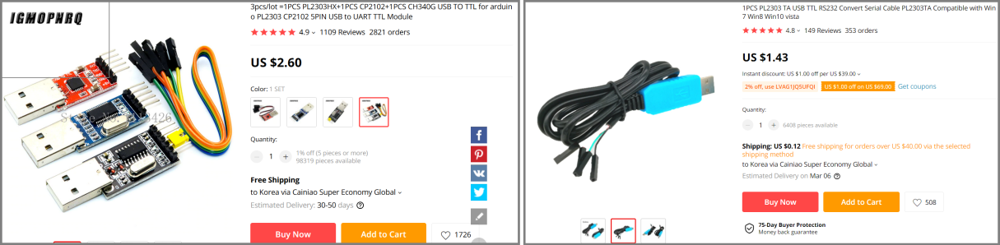

# 시리얼 콘솔

"A long time ago, in a galaxy, far far away .... " <br /><br />

아주 옛날, 이더넷이 널리 보급되기 전, IT 장비 접속은 대부분 시리얼 통신을 이용했었다. 모니터, 키보드 연결이 가능한 서버 장비 뿐 아니라 모니터, 키보드 연결이 불가능한 스위치, 라우터와 같은 네트워크 기기들 역시 시리얼 통신을 이용해 기기에 접속했었다. 다음 그림은 시리얼 통신에 많이 사용하던 9핀 시리얼 케이블이다. 최근에는 보기 힘들지만 이전 서버, 노트북에는 이 케이블을 연결할 수 있는 시리얼 포트가 대부분 있었다. 지금은 대부분 USB 시리얼 포트로 대체되어 이 포트를 장착한 노트북, PC 등은 찾기 힘들어졌다.<br />


PC, 컴퓨터의 이 시리얼 포트는 초고속인터넷이 보급되기 전에는 전화 모뎀을 연결해 인터넷 접속을 하는 중요한 역할을 하기도 했다.
하지만 지금은 모든 컴퓨터가 이더넷 연결이 가능한 랜포트 또는 랜포트 연결 용 젠더를 제공하고 있다. 그리고 리눅스 서버 등의 접속에도 이제는 대부분 이더넷을 사용한다. 서버 IP 및 계정 정보만 있으면 이더넷 접속이 가능한 원격지에서 ssh를 이용해 서버에 접속해 원하는 작업을 할 수 있다. 아마 이 글을 읽은 대부분의 분들도 이 방식에 익숙할 것이다.
<br /><br />

## Raspberry Pi 시리얼 콘솔
하지만 가끔씩 이더넷 접속을 하기 불가능한 경우가 있다. 가령 라즈베리파이의 네트워크 설정이 잘못되어있는데 모니터, 키보드가 없다면 마땅히 라즈베리파이에 접속할 방법이 없다. 이 경우에 유용한 방법이 시리얼 접속이다. 시리얼 접속 방법을 한번 알아두면 응급 상황에서 유용하게 사용할 수 있다.

## 필요한 도구
시리얼 접속을 하려면 위 그림처럼 시리얼 케이블이 필요하다. 하지만 요즈음은 대부분의 컴퓨터에서 위 그림의 9핀 시리얼 포트는 없어지고 USB 포트를 제공한다. 참고로 USB(Universal Serial Bus) 역시 시리얼 통신의 일종이다. USB 포트에 연결해서 시리얼 통신을 할 수 있는 제품이 필요하다. 참고로 파이에서 시리얼 통신은 GPIO 핀을 이용한다. 따라서 한쪽은 USB 반대쪽은 GPIO 핀에 연결가능한 듀폰 케이블 형태의 시리얼 케이블이 필요하다.<br /><br />


위 제품은 AdaFruit사의 제품이며 https://www.adafruit.com/product/954 에서 9.95$에 구매할 수 있다. Aliexpress에서 비슷한 제품을 저렴하게 구매할 수 있다. Aliexpress에서 "USB TO TTL"로 검색하면 여러 제품을 찾을 수 있다.<br /><br />

<br/> <br/> 
대부분의 USB-TTL은 Prolific사의 칩 및 디바이스 드라이버를 사용한다. 설치 드라이버에 첨부된 pdf 파일을 보면 다음 내용이 나온다. 즉 Windows 10 이상의 OS를 사용할 경우 최소한 PL-2303HX (Rev D) 이후의 칩을 사용한 제품을 이용해야 문제가 없다는 것이다. <br /><br />

<br/> <br/>
위 AliExpress에서 검색한 제품 중 좌측 제품은 PL-2303HX으로만 표기되어 있는데  아마도 (Rev A)을 사용하는 것으로 보인다. Windows 10 이하에서는  제품 구매시 칩 종류를 확인해서 우측의 PL2303 TA칩을 사용한 제품을 구매하는 것이 좋다. 

그리고 SD 카드 이미지를 수정할 수 있는 SD카드 리더가 있는 노트북 또는 외장형 리더기를 준비한다.<br/> <br/> 

>⚠️ Windows 11 사용자 : Windows 11에서는 Prolific사 칩을 사용하는 제품이 제대로 작동하지 않는다. 필자도 Windows 11로 업그레이드 이후 이 제품이 인식되지 않아 홈페이지를 찾아보았더니 다음과 같은 설명이 있다.  PL2303 HXD, SA, RA GC, GS, GT, GL, GE , GD, GR 칩을 사용하는 제품들은 Windows 11드라이버 설치가 가능하지만 TH1 1507, TH2 1511, RS1 1607, RS2 1703, RS3 1709, RS4 1803,RS5 1809,19H1 1903, 19H2 1909, 20H1 VB, 21H1 제품들은 Windows 10까지만 사용하다는 내용이다. AliExpress에서 판매중인 대부분의 제품이 구현칩이기 때문에 WIndows 11사용자는 Prolific 칩보다는 FTDI사의 칩을 사용한 제품을 구매하는 것이 좋다.

s


<br/> <br/>

## 제품을 사용하기 전에
아두이노의 경우 대부분의 제품군이 디지털 5V의 입출력 GPIO를 사용한다. 최근에 나온 Nano 33 IoT와 같이 3.3V 로직레벨을 사용하는 제품도 있기는 하다. 아두이노와 라즈베리파이의 GPIO 핀들을 직결할 경우 로직 레벨 전압의 차이로 인해 라즈베리파이가 손상을 입게 된다. 따라서 이 경우에는 반드시 로직레벨 쉬프트(5V와 3.3V를 자동으로 변환해주는 모듈)을 사용해야 한다.

여기서 갑자기 아두이노 이야기를 하는 이유는 USB-TTL 제품들이 대부분 아두이노와 라즈베리파이를 동시에 지원한다. 그러면 이 제품들의 로직 레벨은 3.3V인지 5V인지가 궁금해진다. 만약 5V 로직레벨을 사용한다면 라즈베리파이에 직결로 사용할 수 없을 것이다. 다음 그림은 5V TTL의 로직 레벨을 설명한 그림(https://learn.sparkfun.com/tutorials/logic-levels/ttl-logic-levels )이다.


* VOH -- HIGH 신호(1)를 만드는 최소 출력 전압. 출력전압이 입력 전압보다 낮은 이유는 상대방 디바이스에 신호가 도착하는 동안 전압강하가 발생할 수 있기 때문에 입력전압보다 높게 설정하는 것이 타당하다.
* VIH -- HIGH 신호(1)를 만드는 최소 입력 전압
* VOL -- LOW 신호()를 만드는 최대 출력 전압. 전압 강하를 고려해서 높게 설정할 필요는 없다.
* VIL -- LOW 신호()를 만드는 최대 입력 전압.

위 그림에서 3.3V용 TTL 신호 역시 5V에서도 작동하는 것을 알 수 있다. 대부분의 USB-TTL 제품이 이러한 점을 고려해 3.3V 로직 레벨을 사용하고 있지만 사용전에 반드시 제품의 데이터시트를 확인하거나 설명서에 3.3V를 사용하는 라즈베리파이에서 사용가능한지 여부를 확인하는 것이 안전하다.

그리고 이 이유로 5V 신호를 사용하는 아두이노와 라즈베리파이를 UART통신하려면 반드시 Rx, Tx 선은 가운데 로직 레벨 쉬프트를 경유해야 한다. 


<br/> <br/> 

## Raspberry Pi와 시리얼 케이블 연결
"메이커를 위한 라즈베리파이" 116페이지의 UART 통신편에 파이에서 시리얼 통신을 하는 방법을 자세히 설명하였다.  파이3,4에서 가장 유의할 점은 성능이 뛰어난 하드웨어 UART0(Full UART)가 블루투스 무선 시리얼 통신용으로 바뀜에 따라 UART1(Mini UART)를 사용한다. 아마도 대부분의 독자들은 파이 3,4를 사용할 것이기 때문에 UART1을 사용해서 작업을 하도록 하겠다. UART1은 /dev/ttsS0에 매핑되어 있다. 라즈베리파이 재단에서도 이런 혼돈을 줄이기 위해 "/dev/serial0"을 사용하도록 권장한다. /dev/serial0는 파이2에서는 UART0(/dev/ttyAMA0), 파이 3,4에서는 UART1(/dev/ttsS0)에 매핑되어 있다. 

>⚠️ **Tip**: 시리얼 통신용 GPIO핀은 파이 3,4에서도 14,15번으로 동일하다. USB-TTL 제품의 Rx출력을 파이의 Tx와 Tx 출력을 파이의 Rx와 연결하는 것에 유의한다. 즉 USB 출력을 파이에서 입력받고 파이의 출력을 USB에서 입력 받는 방식으로 이해하면 된다.

다음 그림처럼 3개의 듀폰 케이블 GND, Rx, Tx 핀을 연결한다. 


## Raspberry Pi 설정
앞에서 우리는 파이를 설정하기 위한 키보드, 모니터가 없는 상태를 가정하고 진행해왔다. 파이의 SD 카드 이미지를 노트북에서 직접 수정하도록 하겠다. 파이에서 SD 카드를 제거한 후 노트북에 삽입해서 작업한다. 참고로 SD 카드 이미지는 2개의 파티션이 있는데 그중 하나는 boot 파티션이며 파일 시스템이 ExFAT로 되어있다. 따라서  Windows에서도 이 파티션의 파일은 수정이 가능하다. 파이 시스템의 중요한 설정값들은 대부분 boot 파티션에 존재한다. boot 파티션의 
config.txt 파일에 다음 라인을 추가한다. 라인 위치는 


``` bash
enable_uart=1
```
<br />
아래와 같이 pi4 또는 all 섹션 윗부분 "dtparam=audio=on"라인 아래 부분이 적당하다.

``` bash
# Enable audio (loads snd_bcm2835)
dtparam=audio=on
enable_uart=1

[pi4]
# Enable DRM VC4 V3D driver on top of the dispmanx display stack
dtoverlay=vc4-fkms-v3d
max_framebuffers=2

[all]
# dtoverlay=vc4-fkms-v3d
```

그리고 수정이 끝난 SD 카드를 다시 파이에 삽입한다.

<br/> <br/> 

## 노트북 작업
노트북에 필요한 작업은 미리 해두도록 한다. 드라이버, 프로그램 등이 필요하기 때문에 현장에서 갑자기 진행하려면 시간이 걸릴 뿐 아니라 드라이버 오작동 등의 문제가 발생할 경우 대처가 어렵다. 미리 사무실, 집에서 여러분이 구매한 USB-TTL 제품을 이용해서 테스트까지 끝내두도록 한다.
<br/> <br/> 

### 드라이버 설치
여러분이 가지고 있는 USB-TTL에 사용하는  USB 칩의 종류에 따라 설치 드라이버가 달라진다. 만약 PnP가 지원된다면 자동으로 드라이버가 설치되겠지만 그렇지 않다면 미리 제조사를 확인해서 드라이버를 설치한다. 설치 확인은 장치 관리자에서 할 수 있다. 다음 그림처럼 포트(COM & LPT)에 해당 디바이스가 나타나면 성공이다.
필자의 경우에는 COM8포트에 연결된 디바이스를 확인할 수 있다.


만약 PL2303시리즈 칩을 사용하는 USB-TTL에서 다음과 같은 에러가 발생한다면 앞에서 언급한 것처럼 구형 칩(PL2303HX RevA)를 사용한 제품으로 정상작동하지 않을 수 있다. <br/><br/>


만약 PL2303시리즈 칩을 사용하는 USB-TTL이라면 디바이스 드라이버는 prolific사의 드라이버 제공 홈페이지(http://www.prolific.com.tw/US/ShowProduct.aspx?p_id=225&pcid=41)에서 다운로드 받아서 설치하면 된다.

만약 CH340칩을 사용하는 USB-TTL이라면 마이크로소프트의 (http://www.catalog.update.microsoft.com/Search.aspx?q=CH340)에서 cab 파일을 다운로드 받아서 설치한다. 먼저 cab 파일의 압축을 푼 다음 INF 파일을 클릭하면 디바이스 드리이버가 설치된다. 필자의 경우 위 AliExpress 제품 그림 중에좌측 3개 번들 제품을 구매했는데 2개가 PL2303HXA라서 사용하지 못하고 한개 제품이 CH340칩이라서 마이크로소프트 사이트에서 드라이버를 다운로드 받아서 설치 후 사용이 가능했다.<br/><br/>


<br/> 

### 시리얼 통신 소프트웨어 설치
대부분의 ssh 프로그램은 시리얼 접속 역시 지원한다. 처음에 설명한 것처럼 원격 접속 소프트웨어들은 초기에는 대부분 시리얼 콘솔 접속부터 지원하기 시작했기 때문에 아직도 대부분의 전통있는 ssh 프로그램들은 시리얼 통신을 지원한다.
가장 많이 사용하는 putty를 예로 설명하겠다.
Putty 다운로드 페이지 (https://www.chiark.greenend.org.uk/~sgtatham/putty/latest.html)에서 자신에게 맞는 버젼을 다운로드 설치한다.

<br/> <br/> 

## Raspberry Pi와 노트북을 USB-TTL을 이용해서 연결하기
이제 모든 준비가 끝났기 때문에 파이와 노트북을 USB-TTL을 이용해 연결해보겠다.

<br/> 

### 케이블 연결
USB-TTL과 파이, 노트북을 연결한다.
>⚠️ **Tip**: Rx,Tx, GND 3개만 연결한다. 앞에서 설명한 것처럼 Tx, Rx는 크로스 방식으로 연결하면 된다.
그리고 파이를 부팅한다. 다음 그림은 나의 PC와 라즈베리파이을 USB-TTL을 이용해 연결한 사진이다.


<br/> 

### Putty 접속
Putty를 실행 후 접속 화면에서 Connection Type을 Serial로 변경한 다음, Serial Line 에는 앞에서 확인한 COM  포트, Speed에는 통신 속도를 입력한다. 통신 속도는 저속의 안정된 통신을 원하는 경우에는 9600, 일반적인 경우 115200을 사용한다. Open 버튼을 누르면 다음과 같이 접속된다. 만약 화면 출력이 보이지 않으면 엔터키를 눌러본다.<br/> 


<br/> 이제 여러분은 이더넷을 사용한 ssh와 동일한 방식으로 여러분의 파이를 제어할 수 있다.

<br/> <br/> 

## 마무리
대부분 파이를 다루는 작업은 집 또는 사무실에서 하기 때문에 모니터, 키보드 등을 쉽게 구할 수 있고 이더넷 또는 와이파이 연결 또한 용이하기 때문에 시리얼을 이용한 연결 작업을 할 일은 거의 없다. 하지만 가끔씩 환경이 제대로 갖추어지지 않은 외부에서 파이를 설정해야 하는 경우가 있을 수 있다. 이런 경우를 대비해 위에서 설명한 시리얼 접속 장비를 구비하고 있으면 큰 도움이 될 수 있다. 

참고로 테스트에는 2020-05-27일 발표된 Raspberry Pi OS (32-bit) Lite Minimal image based on Debian Buster 와 라즈베리파이 4를 사용했다. 그리고 USB-TTL은 Aliexpress에서 구매한 제품을 사용했다.


