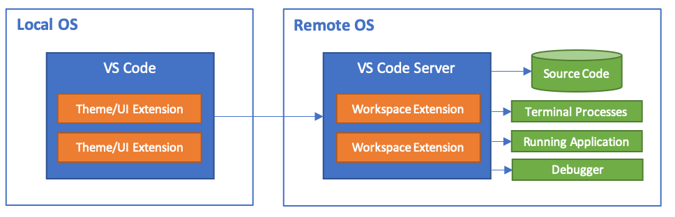
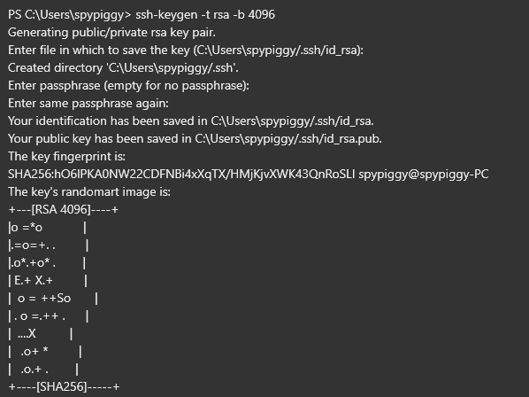

# VSCode 설치(2020년 이후 버젼 사용자)
이 글에서 소개하는 원격 디버깅은 처음 소개 당시(2019년)에는 VCCode Insider에서만 가능했지만 지금은 일반 VSCode에서도 가능하다. 또한 처음 원격 ssh 접속을 VSCode에서 지원했을 당시엔 보안키를 이용한 ssh 접속만 지원했지만 지금은 id/password 방식도 지원한다. 라즈베리파이와 같은 SBC는 SD 카드를 저장공간으로 사용하기 때문에 쉽게 SD카드를 교체해서 사용한다. 이 경우 키 교환방식을 사용하면 이전 SD카드에서 사용했던 키를 사용할 수 없다. 이 때문에 번거롭게 키를 재생성해야 하는 불편함이 있었다.
하지만 최근의 VSCode에서는 id/password 방식을 사용할 수 있기 때문에 이미지 SD 카드 변경시 훨씬 쉽게 사용할 수 있는 장점이 있다.
최신 VSCode를 사용한다면 다음 글을 참조 바란다.[VSCode Remote Python Debugging without ssh keys](https://tipspiggy.blogspot.com/2020/08/vscode-remote-python-debugging-without.html)  

위 글은 NVidia Jetson 시리즈에서 머신러닝을 사용하는 방법을 정리한 제 영문 블로그 글중에서 원격 디버깅에 관한 글이다. 이 글은 NVidia Jetson의 VSCode에서 id/password를 이용해 원격 디버깅을 하는 방법을 설명하고있다. NVidia Jetson 역시 라즈베리파이와 마찬가지로 ARM CPU를 이용하고 있기 때문에 이 글의 내용은 라즈베리파이에서도 그대로 적용 가능하다.

# VSCode Insider 설치(2019년)
2019년 10월, Arm CPU를 사용하는 Raspberry Pi, Jetson Nano, Odroid 등의 SBC를 이용한 원격 개발을 위한 VSCode 확장을 이용하려면 VSCode Insider를 설치해서 사용해야 한다. VSCode Insider는 VSCode와 거의 동일하지만 최신 기능을 먼저 소개하고 테스트할 수 있는 기회를 제공한다. VSCode에서도 Remote Development 확장을 제공하지만 Arm 계열 CPU를 아직 지원하지 않는다. 하지만 VSCode Insider에서 안정성이 검증되면 VSCode에고 적용될 것이기 때문에 항상 확장 설치시 제공되는 페이지를 참조한다. https://code.visualstudio.com/insiders/ 페이지에서 VSCode Insider를 다운로드 받아서 설치한다. Mac과 리눅스 버젼도 제공하기 때문에 자신이 사용하는 개발 환경에 맞게 다운로드하면 된다. 
원격지의 타겟머신에서 프로세스가 실행되기 때문에 사용자의 로컬 머신에는 어떠한 소스 코드, 개발 툴 등의 설치가 필요없다. 또한 운영체제의 차이에도 불구하고 Windows, Mac 등의 로컬 머신에서 Linux, Windows, Mac 등 다양한 OS 환경의 원격 머신에서 작동시킬 파이썬 프로그램의 디버깅이 가능하다. 

# Extension 설치
## VSCode Remote Development Extension 설치

VSCode Insider(이하 VSCode)를 실행한 다음 Extensions 버튼을 누른다. 그리고 remote development를 조회한다.  다음 그림처럼 조회가 될 것이다. 

현재 시점에 우측 상단에 Preview 마크가 붙어 있는 것을 확인할 수 있다. 설명을 읽어보면 이 확장을 설치하면 Remote-SSH, Remote-Container, Remote-WSL 3개의 확장이 설치되는 것을 알 수 있다.

## Python  Extension  설치
다음은 Python 확장을 검색 후 설치한다. 

# 원격 설정
라즈베리 파이의 IP를 확인 한 다음 작업을 진행한다. 이 글에서는 192.168.11.89 값을 가진 파이를 사용하겠다.

## SSH 접속을 위한 Key 생성
VSCode Remote Development 확장을 이용해 원격 장비(라즈베리 파이)에 접속하려면 ssh key를 사용해야 한다.
먼저 다음 과정을 거쳐 키를 생성한다. 키는 개인키(Private Key)와 공용 키(Public Key)가 만들어질 것이다.
콘솔(도스 창)을 연 다음 다음 명령으로 키를 생성한다. 생성 과정의 질문에는 Enter로 넘어가도 무방하다. 

## 원격 컴퓨터 키 복사
생성키가 C:\Users\spypiggy/.ssh/ 디렉토리에 있음을 알 수 있다. 이제 이 키를 원격 컴퓨터(라즈베리 파이)에 반영할 차례이다.
먼저 PC에서 scp 명령을 이용해서 다음과 같이 키를 파이에 복사해넣는다. FileZilla와 같은 툴을 이용해도 무방하다. 공개키(id_rsa.pub)를 파이의 root 홈디렉토리에 복사한다. (필자는 현재 root 계정으로 작업하고 있다. 만약 pi 계정으로 작업하려면 아래 명령에서 root를 pi로 변경한다.) 파이에서 root 원격 접속에 관한 내용은 책 본문 또는 구글링을 통해 쉽게 찾을 수 있다.

>PS C:\Users\spypiggy> scp "C:\Users\spypiggy/.ssh/id_rsa.pub" root@192.168.0.89:~/tmp.pub

## 원격 컴퓨터 키 작업
라즈베리 파이에 ssh 접속후 다음 작업을 진행한다. 조금전 만든 키를 통한 접속을 허용하고 ssh 서비스를 재시작한다. 주의할 것은 같은 root 계정으로 작업해야 홈 경로(~)가 일치한다. 

이제 PC에서 id/pw없이 개인 키를 이용한 접속이 가능하다.  

# 원격 설정
## Remote Development config

이제 다시 PC로 돌아와서 VSCode를 실행한다 그리고 확장 기능을 검색하기 위해 Ctrl + Shift + P키를 누른다. 그리고 Remote-SSH:Connect to Host ...를 선택한다. 그리고 C:\Users\사용자\.ssh\config를 선택한다. 그리고 다음 라인을 추가한다. IP, User, 개인키 경로는 알맞게 수정한다.  

 다시 Ctrl + Shfit + P를 눌러보면 방금 만든 Raspberry 항목이 보인다. 이 항목을 선택하면 파이에 연결이 가능하다.

만약 문제가 없다면 다음 그림과 같이 새창이 나타나면서 좌측 하단에 녹색으로 연결이 표시된다. 이제 메뉴에서 Terminal/New Terminal을 선택하면 하단에 새로운 ssh 콘솔이 열린다. 

## 원격 작업 디렉토리 열기

Explorer버튼, Open Folder버튼을 차례로 누르면 다음 그림처럼 작업 디렉토리를 지정할 수 있다.

이제 다음과 같이 원격 파이의 디렉토리 파일 목록이 좌측에 보이며 하단에는 ssh 터미널이 만들어진다. 원하는 파일을 클릭하면 바로 수정이 가능하다. 

여기까지의 작업만으로도 엄청난 생산성 향상을 볼 수 있다. GUI 환경에서 파일을 수정하고 하단의 터미널에서 바로 실행해서 결과를 확인할 수 있다. 마지막으로 원격 파이썬 디버깅 기능을 추가해 강력한 디버깅 환경을 만들어 보자. 

## 원격 파이썬 디버깅 모듈 설치

원격 디버깅을 위해서는 원격 컴퓨터(파이)에 원격 디버깅이 가능한 확장을 설치해야 한다. Extensions 버튼 또는 Ctrl + Shift + X를 눌런 후 Python을 다시 한번 검색한다. 앞에서 우리는 이미 Python 모듈을 설치했다. 이번에는 Install in SSH:RaspberyPi 버튼이 새롭게 생긴 것을 알 수 있다.
이 버튼을 클릭하면 파이에 파이썬 디버깅을 위한 원격 확장이 설치된다. 

설치가 끝나면 작업창을  reload한다. 이제 파이썬 원격 디버깅을 위한 준비가 끝났다. 

## IntelliCode를 이용한 코드 자동 완성
MS Visual Studio와 같은 IDE 환경에 익숙한 사용자들은 대부분 코드 자동 완성 기능을 애용한다. 코드 자동 완성 기능은 개발 속도를 높일 뿐 아니라 코딩 과정의 오타 발생을 현격하게 줄여주기 때문에 생산성 향상에 큰 도움을 준다.
리눅스 개발환경에서도 이런 코드 자동 완성 기능이 일부 있기는 하지만 Windows, Mac의 IDE와 달리 기능이 제한적이거나 유료제품을 이용해야 하는 경우가 많다. 특히 원격 개발 환경에서는 이러한 기능을 거의 제공하지 않는다. VNC와 같은 원격 제어툴을 이용하는 것은 이 글에서 설명하는 원격 개발 환경과는 거리가 있다.  

원격 파이썬 디버깅 모듈을 설치하고 나면 이제 VSCode에서 원격 컴퓨터에서 작동하는 파이썬 코드를 자동 완성 기능을 이용해 작성할 수 있다. SSH 터미널에서 VI 편집기를 이용해서는 절대 경험할 수 없는 새롭고 강력한 기능이다. 

## 원격 파이썬 디버깅 실습

이제 파이썬 소스코드에 마우스를 좌측 숫자 옆에 가져가면 브레이크포인트를 설정할 수 있다. 원하는 위치에 브레이크포인트를 만든다. 

그리고 디버거 버튼을 누른 후 디버거 시작 버튼을 누른다. 그러면 무엇을 디버깅할 것인지를 물어보면 Python File을 선택한다. 그러면 현재 창의 파이썬 파일을 자동으로 실행한다.    

그리고 브레이크 포인트를 지정한 부분에서 자동으로 멈춘다. 그림처럼 이 시점에서 변수 값을 마우스를 이용해 확인할 수 있으며 좌측 창을 이용해 각종 변수값을 단계별로 모니터링 

현재 시점에서 C/C++확장은 ARM CPU를 지원하지 않기 때문에 C/C++언어를 사용한다면 디버깅까지는 불가능하다. 하지만 조만간 이 부분도 곧 해결되지 않을까 기대한다.
위에서 설명한 파이썬 원격 디버깅은 파이 뿐 아니라 X64 리눅스 서버, 각종 ARM CPU를 사용한 SBC에서도 사용이 가능하다. 여러분의 생산성 향상에 도움이 되길 바란다.

