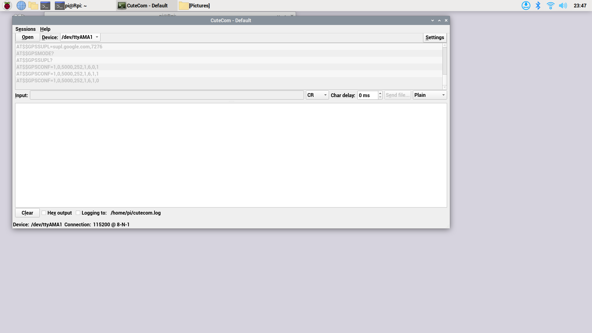

최근 LTE 모뎀을 연결하는 IoT 디바이스를 만들 기회가 있었는데 콘트롤러로는 아두이노 나노 33 IoT를 사용했습니다. 이 제품은 아두이노 제품이지만 로직 레벨이 3.3V입니다. 제품 이름에 33이 포함된 것도 이 때문입니다.
LTE 모뎀은 우리넷의 제품을 사용했는데 모뎀 제어는 UART 또는 USB 통신을 이용할 수 있습니다. 아두이노 또는 라즈베리파이에서는 UART를 쉽게 사용할 수 있기 때문에 UART 방식을 사용했습니다.
그런데 아두이노를 이용한 모뎀제어가 생각처럼 쉽지 않았습니다. 아두이노의 디버깅은 USB 케이블로 연결한 PC의 Serial 모니터를 이용하는 방법이 전부인데 기능상으로 많이 부족하기 때문에 우선 라즈베리파이에서 먼저 검증된 시리얼 프로그램을 이용해 모뎀 제어를 해보기로 하였습니다.
참고로 라즈베리파이 대신 아두이노를 사용한 이유는 아두이노가 소비전력이 상대적으로 낮기 때문입니다. 이 장비는 개인 모빌리티 장비에 연결해서 GPS, 자이로센서 정보 등을 서버에 전송하는데 가능하면 모빌리티 장비의 전력 소모를 줄이기 위해 아두이노를 사용한 것입니다. 그리고 아두이노로도 충분히 구현할 수 있는 기능이기도 했기 때문입니다. 만약 카메라 제어 같은 부분이 추가되었다면 파이 Zero 모델을 고려했을 것입니다.

물론 [serial_console.md](https://github.com/raspberry-pi-maker/RaspberryPi-For-Makers/blob/master/tips/chap-01/serial_console.md)에서 소개한  USB-TTL 장치를 이용해 PC에서도 모뎀 제어가 가능합니다. <br /><br />

## 라즈베리파이 UART
<br />
라즈베리파이의 버젼에 따라 UART가 조금씩 다릅니다. 가장 큰 변화는 파이 2에서 파이 3으로 바뀌면서 블루투스가 지원되면서인데 블루투스는 무선 직렬 통신 즉 무선 시리얼 통신입니다. 
파이 3부터는 블루투스 지원을 위해 UART를 블루투스 통신에 할당했습니다. 파이 3,4에서 어떻게 바뀌었는지 자세히 살펴보겠습니다.
 <br /><br />


### 라즈베리파이 3에서의 UART
<br />
책 117페이지에서 설명한 것처럼 라즈베리파이 2에서는 GPIO 14,15번 핀을 사용하여 UART0를 /dev/tttyAMA0 가상파일에 매핑해서 사용했습니다. 하지만 라즈베리파이 3에서는 앞에서 설명한 것처럼 블루투스를 지원하기 시작하면서 /dev/tttyAMA0를 블루투스 통신 용도로 변경했기 때문에 UART 통신을 하려면 두번째 UART1 (Mini UART)를 /dev/sttS0 가상파일에 매핑해서 사용합니다. 그런데 문제는 Mini UART의 성능이 좋지 않다는 것입니다. 소프트웨어로 UART를 구현한 것이기 때문에 CPU의 부하 상태에 따라 통신이 영향을 받기 때문에 특히 고속 통신에서 안정성이 상대적으로 떨어집니다. <br /><br />

### 라즈베리파이 4에서의 UART
<br />
라즈베리파이 4에 관한 글은 베어팹님의 블로그(https://blog.naver.com/PostList.naver?blogId=emperonics&parentCategoryNo=6)에서 많은 부분을 참조했습니다. 
이번 테스트에는 라즈베리파이 4를 사용할 것이기 때문에 다시 한번 파이 4에서 지원하는 UART 통신을 조사하게 되었습니다. 라즈베리파이 4에서는 앞에서 설명한 UART0, UART1이외에 새롭게 4개의 시리얼 통신을 추가할 수 있습니다. 따라서 시리얼 통신을 하려면 UART1(miniUART) 대신 이 4개 중 하나를 사용하면 됩니다. 
이 4개의 UART를 사용하려면 GPIO핀의 속성을 바꿔야 합니다. 이를 위해 /boot/config.txt 파일을 수정합니다.


수정하기 전에 먼저 이 4개 UART에 대해 살펴봅니다. <br />

``` bash
pi@Rpi:~ $ dtoverlay -a | grep uart
  midi-uart0
  midi-uart1
  midi-uart2
  midi-uart3
  midi-uart4
  midi-uart5
  miniuart-bt
  qca7000-uart0
  uart0
  uart1
  uart2
  uart3
  uart4
  uart5
```
<br />
디바이스 트리(Device Tree)에 uart2 ~ 5가 있는 것을 알 수 있습니다.

만약 UART3을 사용하고자 한다면 다음과 같이 UART3이 사용하는 Rx, Tx GPIO 핀을 확인합니다. <br />

``` bash
pi@Rpi:~ $ dtoverlay -h uart3
Name:   uart3

Info:   Enable uart 3 on GPIOs 4-7. BCM2711 only.

Usage:  dtoverlay=uart3,<param>

Params: ctsrts                  Enable CTS/RTS on GPIOs 6-7 (default off)

```
<br />
uart3은 4, 5번 핀은 Tx, Rx핀으로 사용되고 ctsrts파라미터를 추가하면 6, 7번 핀이 CTS 및 RTS핀으로 사용된다는 것을 알 수 있습니다. UART에서는 Rx, Tx, GND, Vcc만 있으면 충분합니다. CTS, RTS와 같은 제어는 RS232통신에서 사용합니다.
이제 /boot/config.txt 파일을 수정해서 UART3을 사용할 수 있도록 GPIO 핀 용도를 변경합니다. 파일의 마지막 부분에 다음과 같이 "dtoverlay=uart3"을 추가합니다. <br />

``` bash
[all]
gpu_mem=128
enable_uart=1
dtoverlay=uart3
```
<br />
디바이스 트리내용 변경은 반드시 재부팅을 해야 새롭게 적용됩니다. 

``` bash
pi@Rpi:~ $ sudo reboot
```
<br />
이제 용도가 바뀐 핀을 확인해봅니다. 4,5번 핀의 func 항목이 TX3,RX3 으로 바뀐 것을 알 수 있습니다. 만약 2개 이상의 UART 통신이 필요하다면 2,4,5번 UART도 같은 방식으로 활성화시킬 수 있습니다.


``` bash
pi@Rpi:~ $ raspi-gpio get 4-5
GPIO 4: level=1 fsel=3 alt=4 func=TXD3 pull=NONE
GPIO 5: level=1 fsel=3 alt=4 func=RXD3 pull=UP
```


<br /><br />

## 라즈베리파이 4에서 무선 LTE 모뎀 제어

<br />
테스트에 사용한 무선 LTE 모뎀은 LGU+, KT, SKT 통신 3사의 IoT 요금제에 가입한 유심 모두 사용 가능합니다. IoT 요금제가 기업을 위한 제품이기 때문에 개인이 가입하기에는 불편함이 있을 수 있습니다.
이 모뎀은 5V 전압을 받아서 작동하기 때문에 로직 레벨도 5V입니다. 따라서 라즈베리파이와 연결할 때 Rx, Tx에 로직 레벨 시프트(5V와 3.3V 전압 변경)를 원칙적으로 사용해야 합니다. 
그리고 이 LTE 모뎀은 통신 속도가 115200으로 고정되어 있는데 시리얼 통신에서는 꽤 빠른 통신 속도에 해당합니다. 이 떄문에 miniUART 사용을 피한 것입니다.

모뎀 제어를 위한 프로그램은 책에서 소개한 미니콤을 사용할 수 있지만 좀 더 모던한 GUI 프로그램을 찾아보기로 했습니다. 
제가 찾은 프로그램은 cutecom입니다. apt 명령으로 간단하게 설치할 수 있습니다.

``` bash
pi@Rpi:~ $ sudo apt-get install cutecom
```

<br />
다음은 라즈베리파이 4에서 실행한 cutecom의 화면입니다. minicom과 달리 GUI 프로그램이라 사용법이 쉽습니다. 화면에서 /dev/TTYAMA1을 115200 속도로 개방해서 사용하고 있습니다. 우리넷 모뎀은 명령 마지막에 CR(줄바꿈)을 보내면 하나의 명령으로인식하고 반응합니다. 대부분의 모뎀들이 비슷하게 작동합니다. 가장 간단하게 "AT + CR"을 보내면 모뎀은 "OK"를 응답하면서 정상적으로 통신이 되고 있는 것을 알려줍니다. 그림에서 INPUT 뒤에 CR을 보내도록 선택한 것을 알 수 있습니다.



<br />
cutecom은 직관적이고 minicom보다 사용하기 쉽기 때문에 라즈베리파이에서 시리얼 통신 테스트가 필요한 분들은 사용해보시길 권해드립니다. 
라즈베리파이를 이용해서 모뎀제어가 정상임을 확인하고 다시 아두이노 나노 33 IoT에서 몇가지 센서 데이터를 수집해서 LTE 모뎀을 통해 서버측에 수집한 정보를 송신하는 프로그램을 만들 수 있었습니다.
