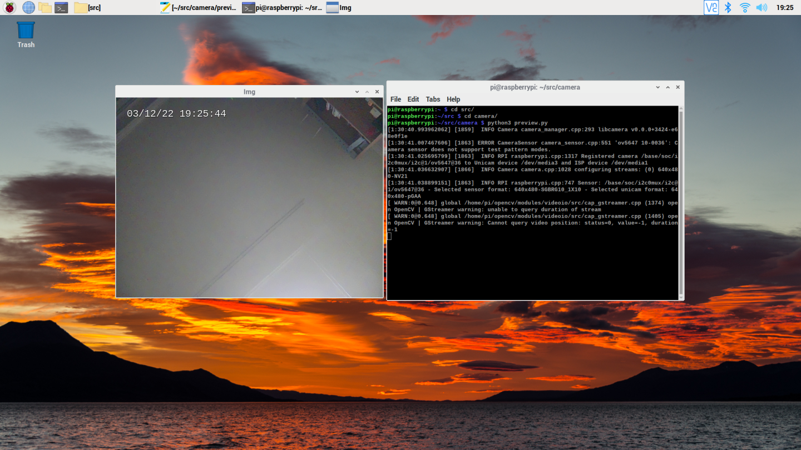

# BullsEye OS
2021년 가을 라즈베리파이 OS가 Buster에서 BullsEye로 바뀌었습니다. 이것은 라즈베리파이 OS의 근간을 이루는 데비안 OS의 업그레이드에 맞추어 진행된 작업입니다. 그리고 2022년 2월 드디어 라즈베리파이 OS 64비트 정식 버젼이 공개되었습니다.
이전 Buster 64비트 베타 버젼이 있었지만 BullsEye에 맞추어 정식 버젼이 공개된 것입니다. 정식 64비트 버젼에 대한 소개는 https://github.com/raspberry-pi-maker/RaspberryPi-For-Makers/blob/master/tips/chap-01/raspberry_pi_os_64.md 에서 해두었습니다.

그런데 라즈베리파이 OS가 BullsEye로 바뀌면서 카메라 제어 부분이 너무 과격하게 바뀌었습니다. 64비트 버젼 소개한 글에서도 카메라 제어 부분 변경에 따른 주의 사항을 말씀드렸지만 여기에서 조금 더 자세히 들여다 보고 OpenCV를 새롭게 사용하는 방법을 알아보겠습니다.<br><br>


## 라즈베리파이 OS BullsEye에서 CSI 카메라 제어
라즈베리파이 OS에서 CSI 카메라를 Legacy 카메라로 지칭하고 있습니다. 그리고 이 카메라 제어는 라즈베리파이의 칩셋 공급사인 브로드컴의 SoC에 맞게 개발되어져 있었습니다. 따라서 상당히 폐쇄적인 구조입니다. 라즈베리파이 재단에서 BullsEye로 OS를 바꾸면서 이 카메라 제어를 개방적인 libcamera로 바꾸면서 기존 소프트웨어와의 호환성 문제가 발생하고 있습니다. 어쩌면 칩셋 공급사를 브로드컴에서 다른 회사로 바꾸려고 하는 것은 아닌지 하는 의문이 듭니다.<br>
다음은 라즈베리파이 카메라 관련 공식 페이지입니다. https://www.raspberrypi.com/documentation/accessories/camera.html . 오픈소스 libcamera로 이동하는 이유를 장황하게 설명하고 있습니다. 

당장 기존 파이썬 개발에 사용하던 PiCamera  모듈을 사용할 수 없게 되었습니다. 이 모듈은 당연히 기존 폐쇄적인 Legacy 카메라 제어를 이용하고 있기 때문에 새로운  libcamera에서는 사용할 수 없습니다. 라즈베리파이 재단에서는 libcamera 용 PiCamera2를 만들고 있습니다. 깃허브(https://github.com/raspberrypi/picamera2)에서 현재(2022.03)까지 개발된 picamera2 베타 버젼을 다운로드 받아서 테스트해볼 수 있습니다. 그렇지만 API가 100% 동일하게 유지하는 것은 불가능하기 때문에 기존에 만든 파이썬 프로그램을 libcamera용으로 수정해야 하는 작업은 피할 수 없습니다. 다음은 libcamera와 기존 raspicam 프로그램간의 비교입니다. 기존에 사용하던 raspicam 프로그램에 대응하는 libcamera 프로그램들이 존재하기 때문에 명령창에서 미리보기, 사진찍기, 비디오 촬영 등의 작업은 문제가 없습니다. <br><br>

|libcamera-apps |설명|대응 raspicam app|
|------|---|---|
|libcamera-hello|미리보기 창을 이용해 카메라 화면을 보여줍니다.|raspistill -t 5|
|libcamera-jpeg|jpeg 파일 촬영|raspistill -o image.jpg
|libcamera-still|raspistill과 유사하게 libcamera-jpeg보다 정교한 옵션 제공. |raspistill|
|libcamera-vid|비디오 촬영|raspivid
|libcamera-detect|Tensorflow Lite와 함께 사용. 객체가 인식되면 자동으로 JPEG 이미지 로 촬영함|

<br><br>

하지만 개발자 입장에서는 전혀 다른 이야기입니다. 기존 프로그램들을 모두 사용할 수 없게 만든 상황에서 어쩔 수 없이 라즈베리파이 재단은 BullsEye에서 기존 Legacy 카메라를 사용할 수 있도록 raspi-config를 개선했습니다. 참고로 libcamera, legacy camera를 동시에 사용할 수는 없습니다. raspi-config에서 Interface Options/Legacy Camera를 활성화하면 기존 Legacy 카메라 모드로 복귀합니다. 이전처럼 카메라 비활성화, 활성화 옵션이 아닙니다. 따라서 libcamera를 사용할 경우에는 이 옵션을 활성화하면 안됩니다.

[](https://www.youtube.com/watch?v=E7KPSc_Xr24) 
<center> Legacy 모드복귀 방법을 설명하는 유튜브</center>
<br><br>
카메라 솔루션을 사용하고 있다면 BullsEye OS로의 업그레이드는 신중하게 진행하는 것이  좋다고 생각하고 있습니다.

<br><br>

# BullsEye에서의 OpenCV 

BullsEye는 32비트 64비트 OS 모두 존재하지만 아래 테스트에서는 64비트 기준으로 진행하겠습니다. 64비트 OS 소개에서도 64비트 OS 사용의 장점을 말씀드렸으며 가능한 64비트 OS를 사용하길 추천합니다.<br><br>

## pip을 이용한 OpenCV설치 
BullsEye에서 손쉽게 OpenCV를 설치하는 방법이 있습니다. 파이썬 pip 명령을 이용하는 방법입니다. 2022년 3월 현재 최신 버젼인 4.5.5가 설치되고 있습니다.
``` bash
pi@raspberrypi8GB:~ $ pip3 install opencv-python
Looking in indexes: https://pypi.org/simple, https://www.piwheels.org/simple
Collecting opencv-python
  Downloading opencv_python-4.5.5.64-cp36-abi3-manylinux_2_17_aarch64.manylinux2014_aarch64.whl (39.2 MB)
     |████████████████████████████████| 39.2 MB 17 kB/s 
Requirement already satisfied: numpy>=1.19.3 in /usr/lib/python3/dist-packages (from opencv-python) (1.19.5)
Installing collected packages: opencv-python
Successfully installed opencv-python-4.5.5.64
```
<br><br>
그리고 pip을 이용해 설치한 패키지의 빌드 정보를 살펴보겠습니다. cv2.getBuildInformation() 함수는 빌드 정보를 출력해줍니다.

``` bash
pi@raspberrypi8GB:~ $ python
Python 3.9.2 (default, Feb 28 2021, 17:03:44) 
[GCC 10.2.1 20210110] on linux
Type "help", "copyright", "credits" or "license" for more information.
>>> import cv2
>>> print(cv2.getBuildInformation())

General configuration for OpenCV 4.5.5 =====================================
  Version control:               4.5.5-dirty

  Platform:
    Timestamp:                   2022-03-04T10:02:17Z
    Host:                        Linux 4.9.140-tegra aarch64
    CMake:                       3.22.2
    CMake generator:             Unix Makefiles
    CMake build tool:            /bin/gmake
    Configuration:               Release

  CPU/HW features:
    Baseline:                    NEON FP16

  C/C++:
    Built as dynamic libs?:      NO
    C++ standard:                11
    C++ Compiler:                /opt/rh/devtoolset-10/root/usr/bin/c++  (ver 10.2.1)
    C++ flags (Release):         -Wl,-strip-all   -fsigned-char -W -Wall -Werror=return-type -Werror=non-virtual-dtor -Werror=address -Werror=sequence-point -Wformat -Werror=format-security -Wmissing-declarations -Wundef -Winit-self -Wpointer-arith -Wshadow -Wsign-promo -Wuninitialized -Wsuggest-override -Wno-delete-non-virtual-dtor -Wno-comment -Wimplicit-fallthrough=3 -Wno-strict-overflow -fdiagnostics-show-option -pthread -fomit-frame-pointer -ffunction-sections -fdata-sections    -fvisibility=hidden -fvisibility-inlines-hidden -O3 -DNDEBUG  -DNDEBUG
    C++ flags (Debug):           -Wl,-strip-all   -fsigned-char -W -Wall -Werror=return-type -Werror=non-virtual-dtor -Werror=address -Werror=sequence-point -Wformat -Werror=format-security -Wmissing-declarations -Wundef -Winit-self -Wpointer-arith -Wshadow -Wsign-promo -Wuninitialized -Wsuggest-override -Wno-delete-non-virtual-dtor -Wno-comment -Wimplicit-fallthrough=3 -Wno-strict-overflow -fdiagnostics-show-option -pthread -fomit-frame-pointer -ffunction-sections -fdata-sections    -fvisibility=hidden -fvisibility-inlines-hidden -g  -O0 -DDEBUG -D_DEBUG
    C Compiler:                  /opt/rh/devtoolset-10/root/usr/bin/cc
    C flags (Release):           -Wl,-strip-all   -fsigned-char -W -Wall -Werror=return-type -Werror=address -Werror=sequence-point -Wformat -Werror=format-security -Wmissing-declarations -Wmissing-prototypes -Wstrict-prototypes -Wundef -Winit-self -Wpointer-arith -Wshadow -Wuninitialized -Wno-comment -Wimplicit-fallthrough=3 -Wno-strict-overflow -fdiagnostics-show-option -pthread -fomit-frame-pointer -ffunction-sections -fdata-sections    -fvisibility=hidden -O3 -DNDEBUG  -DNDEBUG
    C flags (Debug):             -Wl,-strip-all   -fsigned-char -W -Wall -Werror=return-type -Werror=address -Werror=sequence-point -Wformat -Werror=format-security -Wmissing-declarations -Wmissing-prototypes -Wstrict-prototypes -Wundef -Winit-self -Wpointer-arith -Wshadow -Wuninitialized -Wno-comment -Wimplicit-fallthrough=3 -Wno-strict-overflow -fdiagnostics-show-option -pthread -fomit-frame-pointer -ffunction-sections -fdata-sections    -fvisibility=hidden -g  -O0 -DDEBUG -D_DEBUG
    Linker flags (Release):      -L/root/ffmpeg_build/lib  -Wl,--gc-sections -Wl,--as-needed  
    Linker flags (Debug):        -L/root/ffmpeg_build/lib  -Wl,--gc-sections -Wl,--as-needed  
    ccache:                      YES
    Precompiled headers:         NO
    Extra dependencies:          /lib64/libopenblas.so Qt5::Core Qt5::Gui Qt5::Widgets Qt5::Test Qt5::Concurrent /lib64/libz.so dl m pthread rt
    3rdparty dependencies:       libprotobuf ade ittnotify libjpeg-turbo libwebp libpng libtiff libopenjp2 IlmImf quirc tegra_hal

  OpenCV modules:
    To be built:                 calib3d core dnn features2d flann gapi highgui imgcodecs imgproc ml objdetect photo python3 stitching video videoio
    Disabled:                    world
    Disabled by dependency:      -
    Unavailable:                 java python2 ts
    Applications:                -
    Documentation:               NO
    Non-free algorithms:         NO

  GUI:                           QT5
    QT:                          YES (ver 5.15.0 )
      QT OpenGL support:         NO
    GTK+:                        NO
    VTK support:                 NO

  Media I/O: 
    ZLib:                        /lib64/libz.so (ver 1.2.7)
    JPEG:                        libjpeg-turbo (ver 2.1.2-62)
    WEBP:                        build (ver encoder: 0x020f)
    PNG:                         build (ver 1.6.37)
    TIFF:                        build (ver 42 - 4.2.0)
    JPEG 2000:                   build (ver 2.4.0)
    OpenEXR:                     build (ver 2.3.0)
    HDR:                         YES
    SUNRASTER:                   YES
    PXM:                         YES
    PFM:                         YES

  Video I/O:
    DC1394:                      NO
    FFMPEG:                      YES
      avcodec:                   YES (58.134.100)
      avformat:                  YES (58.76.100)
      avutil:                    YES (56.70.100)
      swscale:                   YES (5.9.100)
      avresample:                NO
    GStreamer:                   NO
    v4l/v4l2:                    YES (linux/videodev2.h)

  Parallel framework:            pthreads

  Trace:                         YES (with Intel ITT)

  Other third-party libraries:
    Lapack:                      YES (/lib64/libopenblas.so)
    Eigen:                       NO
    Custom HAL:                  YES (carotene (ver 0.0.1))
    Protobuf:                    build (3.19.1)

  OpenCL:                        YES (no extra features)
    Include path:                /io/opencv/3rdparty/include/opencl/1.2
    Link libraries:              Dynamic load

  Python 3:
    Interpreter:                 /opt/python/cp36-cp36m/bin/python3.6 (ver 3.6.15)
    Libraries:                   libpython3.6m.a (ver 3.6.15)
    numpy:                       /opt/python/cp36-cp36m/lib/python3.6/site-packages/numpy/core/include (ver 1.19.3)
    install path:                python/cv2/python-3

  Python (for build):            /bin/python2.7

  Java:                          
    ant:                         NO
    JNI:                         NO
    Java wrappers:               NO
    Java tests:                  NO

  Install to:                    /io/_skbuild/linux-aarch64-3.6/cmake-install
-----------------------------------------------------------------

```

<br /><br />

위에서 유심히 살펴야 하는 부분이 있습니다. Video I/O에서 GStreamer 값입니다. pip으로 설치한 OpenCV 4.5.5는 이 값이 No입니다. 즉 OpenCV 빌드 옵션에서 "-D WITH_GSTREAMER=ON"를 사용하지 않았습니다. 따라서 이 패키지는 GStreamer와 함께 사용이 불가능합니다.<br /><br />

이제 이 패키지를 이용해서 라즈베리파이 CSI 카메라를 제어해보겠습니다. 라즈베리파이에는 CSI 카메라 1개만 연결해 두었고 셈플 코드는 간단한 카메라 미리보기 파이썬 코드입니다. <br/><br/>

``` python
import cv2
import sys
cap = cv2.VideoCapture(0)
if cap.isOpened() == False:
    print('camera open Failed')
    sys.exit(0)

cap.set(cv2.CAP_PROP_FRAME_WIDTH,640);
cap.set(cv2.CAP_PROP_FRAME_HEIGHT,480);

while True:

    succes, img = cap.read()
    if succes == False:
        print('camera read Failed')
        sys.exit(0)
    k = cv2.waitKey(1)
    if k == ord('q'):
        break
    cv2.imshow('Img',img)
cap.release()
cv2.destroyAllWindows()
```
<br/><br/>
그리고 파이썬 프로그램을 테스트하기 전에 미리 카메라를 확인해보겠습니다. /dev/video0이 존재하고 있습니다. <br/><br/>
``` bash
pi@raspberrypi8GB:~ $ ls  /dev/video*
/dev/video0  /dev/video10  /dev/video11  /dev/video12  /dev/video13  /dev/video14  /dev/video15  /dev/video16  /dev/video18  /dev/video20  /dev/video21  /dev/video22  /dev/video23
```
<br/><br/>
이제 파이썬 프로그램을 실행합니다. 그런데 에러가 발생합니다. 카메라 연결 상태는  libcamera-hello 명령으로 테스트했을 때에는 정상 작동합니다. <br/><br/>
``` bash
pi@raspberrypi8GB:~/src $ python3 preview.py 
camera read Failed
```
<br /><br />
이 문제는 사용중인 OpenCV에서 libcamera를 제대로 처리하지 못해서 발생하는 문제입니다. 만약 raspi-config에서 Legacy Camera를 활성화시키고 리부팅 후 다시 이 프로그램을 테스트해보겠습니다. 정상작동하는 것을 확인할 수 있습니다. 결국 파이썬 코드의 문제가 아니라 OpenCV에서 libcamera를 처리하지 못해서 발생하는 문제였던 것입니다.<br/><br/>

<center> Legacy 모드에서 정상 작동 화면</center>
<br /><br />


## GStreamer와 OpenCV<br><br>
제가 주로 사용하는 SBC(Single Board Computer)는 라즈베리파이, 젯슨 나노, 젯슨 Xavier NX 그리고 국산 오드로이드입니다. 개발 용도로는 라즈베리파이와 젯슨 시리즈를 많이 사용합니다. 그런데 젯슨 시리즈에서는 라즈베리파이용 카메라 모듈 V2의 사용이 가능합니다. 그리고 젯슨 시리즈에서 카메라를 제어하는 OpenCV코드를 보면 GStreamer를 사용합니다.
다음은 제 블로그 글 [Camera - CSI Camera (Raspberry Pi camera V2)](https://spyjetson.blogspot.com/2020/02/camera-csi-camera-raspberry-pi-camera-v2.html)의 일부입니다. 이 글에서는 젯슨 시리즈에서 라즈베리파이 카메라를 사용하는 방법에 대해 설명하고 있습니다.


``` python
def gstreamer_pipeline(
    capture_width=1280,
    capture_height=720,
    display_width=1280,
    display_height=720,
    framerate=60,
    flip_method=0,
):
    return (
        "nvarguscamerasrc ! "
        "video/x-raw(memory:NVMM), "
        "width=(int)%d, height=(int)%d, "
        "format=(string)NV12, framerate=(fraction)%d/1 ! "
        "nvvidconv flip-method=%d ! "
        "video/x-raw, width=(int)%d, height=(int)%d, format=(string)BGRx ! "
        "videoconvert ! "
        "video/x-raw, format=(string)BGR ! appsink"
        % (
            capture_width,
            capture_height,
            framerate,
            flip_method,
            display_width,
            display_height,
        )
    )

  ...... 중략
  cap = cv2.VideoCapture(gstreamer_pipeline(flip_method=0), cv2.CAP_GSTREAMER)

```
cv2.VideoCapture 함수에서 일반적으로 사용하는 번호 대신 gstreamer에 전달하는 파이프라인 문자열을 사용하고 있습니다. 저도 이 부분을 무심코 넘겼었는데 BullsEye에서 바뀐 라즈베리파이 카메라 스택 구조를 보고나서 NVidia에서 왜 이런 방식을 사용했는지 이해가 갔습니다. Gstreamer는 오픈소스 카메라 스택 libcamera를 잘 구현하고 있을 뿐 아니라 NVidia의 SoC에 맞는 파이프라인 컴포넌트(위 문자열에서 "nvarguscamerasrc")를 만들어 추가함으로써 카메라 제어를 쉽게 할 수 있었기 때문입니다.

결론은 BullsEye의 새로운 카메라 스택인 libcamera에서 OpenCV를 사용하려면 우리도 GStreamer를 사용해야 한다는 것입니다. 앞에서  pip으로 설치한 OpenCV는 GStreamer를 지원하지 않는다는 것을 확인했습니다. 그러면 GStreamer를 지원하도록 OpenCV를 직접 빌드해야 한다는 결론이 나왔습니다.
<br /><br />


# BullsEye 64비트에서 GStreamer 지원 OpenCV 빌드 
OpenCV는 꽤 큰 패키지입니다. 라즈베리파이 4에서 빌드 시간이 약 1 ~ 2 시간 정도 필요합니다. 그리고 빌으에 메모리도 많이 필요하기 때문에 2GB 모델을 사용하는 분들은 가상메모리를 확보해 메모리를 늘린 다음 빌드하는 것이 좋습니다. <br /><br />

## 가상메모리 확보 
2GB모델 사용자에게만 적용됩니다.
가상메모리를 늘리는 방법은 2가지입니다. 이전에는 스왑파일을 이용하는 방법을 많이 사용했지만 최근에는 RAM을 압축해서 메모리를 늘리는 zram 사용을 추천하는 경향이 있습니다. 어떤 방법을 택하던 큰 문제는 없습니다. 두가지 모두 사용해도 됩니다.<br /><br />

### swap 파일 사용 
2GB모델 사용자에게만 적용됩니다.

``` bash
$ sudo nano /etc/dphys-swapfile

#아래 값을 찾아서 4096으로 늘린 다음 저장한다. 
CONF_MAXSWAP=4096

# reboot
$ sudo reboot
```
<br/><br/>

### zram 사용 
``` bash
$ git clone https://github.com/StuartIanNaylor/zram-swap-config \
&& cd zram-swap-config
$ sudo ./install.sh

$ sudo nano /etc/zram-swap-config.conf
#그리고 아래 내용을 찾아서 수정해준다. (압축 알고리즘만 바꾼것이라서 수정없이 적용해도 큰 차이는 없다.)
MEM_FACTOR=40
DRIVE_FACTOR=300
COMP_ALG=lz4
SWAP_DEVICES=1
SWAP_PRI=75
PAGE_CLUSTER=0
SWAPPINESS=90

# reboot
$ sudo reboot
```

이제 재부팅 후 free -m 명령으로 메모리를 확인하면 swap 부분이 많이 늘어난 것을 확인할 수 있을 것이다. <br><br>


## BullsEye OS에서 OpenCV 빌드(32비트, 64비트 공통) 

다음은 빌드를 
이 스크립트는 [Install OpenCV 4.5 on Raspberry Pi 4](https://qengineering.eu/install-opencv-4.5-on-raspberry-pi-4.html)에서 소개한 내용입니다. 아래 스크립트에서 4.5.5를 원하는 버젼으로 바꾸면 해당 버젼의 코드를 빌드합니다. 


``` bash
#!/bin/bash
set -e
echo "Installing OpenCV 4.5.5 on your Raspberry Pi 64-bit OS"
echo "It will take minimal 2.0 hour !"
cd ~
# install the dependencies
sudo apt-get install -y build-essential cmake git unzip pkg-config
sudo apt-get install -y libjpeg-dev libtiff-dev libpng-dev
sudo apt-get install -y libavcodec-dev libavformat-dev libswscale-dev
sudo apt-get install -y libgtk2.0-dev libcanberra-gtk* libgtk-3-dev
sudo apt-get install -y libgstreamer1.0-dev gstreamer1.0-gtk3
sudo apt-get install -y libgstreamer-plugins-base1.0-dev gstreamer1.0-gl
sudo apt-get install -y libxvidcore-dev libx264-dev
sudo apt-get install -y python3-dev python3-numpy python3-pip
sudo apt-get install -y libtbb2 libtbb-dev libdc1394-22-dev
sudo apt-get install -y libv4l-dev v4l-utils
sudo apt-get install -y libopenblas-dev libatlas-base-dev libblas-dev
sudo apt-get install -y liblapack-dev gfortran libhdf5-dev
sudo apt-get install -y libprotobuf-dev libgoogle-glog-dev libgflags-dev
sudo apt-get install -y protobuf-compiler

# download the latest version
cd ~ 
sudo rm -rf opencv*
wget -O opencv.zip https://github.com/opencv/opencv/archive/4.5.5.zip 
wget -O opencv_contrib.zip https://github.com/opencv/opencv_contrib/archive/4.5.5.zip 
# unpack
unzip opencv.zip 
unzip opencv_contrib.zip 
# some administration to make live easier later on
mv opencv-4.5.5 opencv
mv opencv_contrib-4.5.5 opencv_contrib
# clean up the zip files
rm opencv.zip
rm opencv_contrib.zip

# set install dir
cd ~/opencv
mkdir build
cd build

# run cmake
cmake -D CMAKE_BUILD_TYPE=RELEASE \
-D CMAKE_INSTALL_PREFIX=/usr/local \
-D OPENCV_EXTRA_MODULES_PATH=~/opencv_contrib/modules \
-D ENABLE_NEON=ON \
-D WITH_OPENMP=ON \
-D WITH_OPENCL=OFF \
-D BUILD_TIFF=ON \
-D WITH_FFMPEG=ON \
-D WITH_TBB=ON \
-D BUILD_TBB=ON \
-D WITH_GSTREAMER=ON \
-D BUILD_TESTS=OFF \
-D WITH_EIGEN=OFF \
-D WITH_V4L=ON \
-D WITH_LIBV4L=ON \
-D WITH_VTK=OFF \
-D WITH_QT=OFF \
-D OPENCV_ENABLE_NONFREE=ON \
-D INSTALL_C_EXAMPLES=OFF \
-D INSTALL_PYTHON_EXAMPLES=OFF \
-D PYTHON3_PACKAGES_PATH=/usr/lib/python3/dist-packages \
-D OPENCV_GENERATE_PKGCONFIG=ON \
-D BUILD_EXAMPLES=OFF ..

# run make
make -j4
sudo make install
sudo ldconfig

# cleaning (frees 300 MB)
make clean
sudo apt-get update

echo "Congratulations!"
echo "You've successfully installed OpenCV 4.5.5 on your Raspberry Pi 64-bit OS"

```

위 내용으로 install_opencv.sh 파일을 만들어 실행하면 됩니다.
빌드가 끝나면 자동으로 설치까지 하도록 스크립트가 만들어져 있습니다. 그기로 가장 중요한 것은 빌드 옵션에 "-D WITH_GSTREAMER=ON " 가 추가되어 있다는 것입니다. 약 1시간 이상의 빌드 시간이 필요합니다.

``` bash
# 만약 pip으로 설치한 버젼이 있으면 삭제후 설치한다.
$ pip3 uninstall opencv-python
$ chmod 755 install_opencv.sh
$ ./install_opencv.sh
```

<br /><br />


# GStreamer 지원 OpenCV 확인
빌드 스크립트는 설치까지 해주기 때문에 이제 다시 빌드 정보를 확인해봅니다.

``` bash
pi@raspberrypi:~/src $ python3
Python 3.9.2 (default, Feb 28 2021, 17:03:44) 
[GCC 10.2.1 20210110] on linux
Type "help", "copyright", "credits" or "license" for more information.
>>> import cv2
>>> print(cv2.getBuildInformation())

General configuration for OpenCV 4.5.5 =====================================
  Version control:               unknown

  Extra modules:
    Location (extra):            /home/pi/opencv_contrib/modules
    Version control (extra):     unknown

  Platform:
    Timestamp:                   2022-03-11T01:35:23Z
    Host:                        Linux 5.10.103-v8+ aarch64
    CMake:                       3.18.4
    CMake generator:             Unix Makefiles
    CMake build tool:            /usr/bin/gmake
    Configuration:               RELEASE

  CPU/HW features:
    Baseline:                    NEON FP16
      required:                  NEON

  C/C++:
    Built as dynamic libs?:      YES
    C++ standard:                11
    C++ Compiler:                /usr/bin/c++  (ver 10.2.1)
    C++ flags (Release):         -fsigned-char -W -Wall -Werror=return-type -Werror=non-virtual-dtor -Werror=address -Werror=sequence-point -Wformat -Werror=format-security -Wmissing-declarations -Wundef -Winit-self -Wpointer-arith -Wshadow -Wsign-promo -Wuninitialized -Wsuggest-override -Wno-delete-non-virtual-dtor -Wno-comment -Wimplicit-fallthrough=3 -Wno-strict-overflow -fdiagnostics-show-option -pthread -fomit-frame-pointer -ffunction-sections -fdata-sections    -fvisibility=hidden -fvisibility-inlines-hidden -fopenmp -O3 -DNDEBUG  -DNDEBUG
    C++ flags (Debug):           -fsigned-char -W -Wall -Werror=return-type -Werror=non-virtual-dtor -Werror=address -Werror=sequence-point -Wformat -Werror=format-security -Wmissing-declarations -Wundef -Winit-self -Wpointer-arith -Wshadow -Wsign-promo -Wuninitialized -Wsuggest-override -Wno-delete-non-virtual-dtor -Wno-comment -Wimplicit-fallthrough=3 -Wno-strict-overflow -fdiagnostics-show-option -pthread -fomit-frame-pointer -ffunction-sections -fdata-sections    -fvisibility=hidden -fvisibility-inlines-hidden -fopenmp -g  -O0 -DDEBUG -D_DEBUG
    C Compiler:                  /usr/bin/cc
    C flags (Release):           -fsigned-char -W -Wall -Werror=return-type -Werror=address -Werror=sequence-point -Wformat -Werror=format-security -Wmissing-declarations -Wmissing-prototypes -Wstrict-prototypes -Wundef -Winit-self -Wpointer-arith -Wshadow -Wuninitialized -Wno-comment -Wimplicit-fallthrough=3 -Wno-strict-overflow -fdiagnostics-show-option -pthread -fomit-frame-pointer -ffunction-sections -fdata-sections    -fvisibility=hidden -fopenmp -O3 -DNDEBUG  -DNDEBUG
    C flags (Debug):             -fsigned-char -W -Wall -Werror=return-type -Werror=address -Werror=sequence-point -Wformat -Werror=format-security -Wmissing-declarations -Wmissing-prototypes -Wstrict-prototypes -Wundef -Winit-self -Wpointer-arith -Wshadow -Wuninitialized -Wno-comment -Wimplicit-fallthrough=3 -Wno-strict-overflow -fdiagnostics-show-option -pthread -fomit-frame-pointer -ffunction-sections -fdata-sections    -fvisibility=hidden -fopenmp -g  -O0 -DDEBUG -D_DEBUG
    Linker flags (Release):      -Wl,--gc-sections -Wl,--as-needed  
    Linker flags (Debug):        -Wl,--gc-sections -Wl,--as-needed  
    ccache:                      NO
    Precompiled headers:         NO
    Extra dependencies:          dl m pthread rt
    3rdparty dependencies:

  OpenCV modules:
    To be built:                 aruco barcode bgsegm bioinspired calib3d ccalib core datasets dnn dnn_objdetect dnn_superres dpm face features2d flann freetype fuzzy gapi hdf hfs highgui img_hash imgcodecs imgproc intensity_transform line_descriptor mcc ml objdetect optflow phase_unwrapping photo plot python3 quality rapid reg rgbd saliency shape stereo stitching structured_light superres surface_matching text tracking ts video videoio videostab wechat_qrcode xfeatures2d ximgproc xobjdetect xphoto
    Disabled:                    world
    Disabled by dependency:      -
    Unavailable:                 alphamat cudaarithm cudabgsegm cudacodec cudafeatures2d cudafilters cudaimgproc cudalegacy cudaobjdetect cudaoptflow cudastereo cudawarping cudev cvv java julia matlab ovis python2 sfm viz
    Applications:                perf_tests apps
    Documentation:               NO
    Non-free algorithms:         YES

  GUI:                           GTK3
    GTK+:                        YES (ver 3.24.24)
      GThread :                  YES (ver 2.66.8)
      GtkGlExt:                  NO

  Media I/O: 
    ZLib:                        /usr/lib/aarch64-linux-gnu/libz.so (ver 1.2.11)
    JPEG:                        /usr/lib/aarch64-linux-gnu/libjpeg.so (ver 62)
    WEBP:                        build (ver encoder: 0x020f)
    PNG:                         /usr/lib/aarch64-linux-gnu/libpng.so (ver 1.6.37)
    TIFF:                        build (ver 42 - 4.2.0)
    JPEG 2000:                   build (ver 2.4.0)
    OpenEXR:                     build (ver 2.3.0)
    HDR:                         YES
    SUNRASTER:                   YES
    PXM:                         YES
    PFM:                         YES

  Video I/O:
    DC1394:                      YES (2.2.6)
    FFMPEG:                      YES
      avcodec:                   YES (58.91.100)
      avformat:                  YES (58.45.100)
      avutil:                    YES (56.51.100)
      swscale:                   YES (5.7.100)
      avresample:                NO
    GStreamer:                   YES (1.18.4)
    v4l/v4l2:                    YES (linux/videodev2.h)

  Parallel framework:            TBB (ver 2020.2 interface 11102)

  Trace:                         YES (with Intel ITT)

  Other third-party libraries:
    Lapack:                      NO
    Custom HAL:                  YES (carotene (ver 0.0.1))
    Protobuf:                    build (3.19.1)

  Python 3:
    Interpreter:                 /usr/bin/python3 (ver 3.9.2)
    Libraries:                   /usr/lib/aarch64-linux-gnu/libpython3.9.so (ver 3.9.2)
    numpy:                       /usr/lib/python3/dist-packages/numpy/core/include (ver 1.19.5)
    install path:                /usr/lib/python3/dist-packages/cv2/python-3.9

  Python (for build):            /usr/bin/python3

  Java:                          
    ant:                         NO
    JNI:                         NO
    Java wrappers:               NO
    Java tests:                  NO

  Install to:                    /usr/local
-----------------------------------------------------------------
```
<br /><br />

Video I/O에서 GStreamer가 YES(1.18.4)로 바뀐 것을 알 수 있습니다. 이제 우리가 빌드한 OpenCV는 GStreamer를 사용할 수 있습니다.  BullsEye에는 GStreamer관련 패키지들이 일부 설치되어 있지만 OpenCV에서 GStreamer를 사용하려면 몇가지 프로그램을 추가로 설치해야 합니다.

``` bash
# install a missing dependency
$ sudo apt-get install libx264-dev libjpeg-dev
# install the remaining plugins
$ sudo apt-get install libgstreamer1.0-dev \
     libgstreamer-plugins-base1.0-dev \
     libgstreamer-plugins-bad1.0-dev \
     gstreamer1.0-plugins-ugly \
     gstreamer1.0-tools
# install some optional plugins
$ sudo apt-get install gstreamer1.0-gl gstreamer1.0-gtk3
# if you have Qt5 install this plugin
$ sudo apt-get install gstreamer1.0-qt5
```
<br /><br />

이제 GStreamer가 카메라를 제대로 제어하는지 확인해보겠습니다. GStreamer 파이프라인이 libcamerasrc에서 시작하는 것을 알 수 있습니다.
``` bash
pi@raspberrypi:~ $ gst-launch-1.0 libcamerasrc  ! video/x-raw, width=1280, height=720, framerate=30/1 ! videoconvert ! videoscale ! clockoverlay time-format="%D %H:%M:%S" ! video/x-raw, width=640, height=360 ! autovideosink
Setting pipeline to PAUSED ...
[0:50:02.423348871] [1666]  INFO Camera camera_manager.cpp:293 libcamera v0.0.0+3424-e68e0f1e
[0:50:02.436735159] [1669] ERROR CameraSensor camera_sensor.cpp:551 'ov5647 10-0036': Camera sensor does not support test pattern modes.
[0:50:02.454558105] [1669]  INFO RPI raspberrypi.cpp:1317 Registered camera /base/soc/i2c0mux/i2c@1/ov5647@36 to Unicam device /dev/media3 and ISP device /dev/media1
Pipeline is live and does not need PREROLL ...
Pipeline is PREROLLED ...
Setting pipeline to PLAYING ...
New clock: GstSystemClock
[0:50:02.467184089] [1672]  INFO Camera camera.cpp:1028 configuring streams: (0) 1280x720-NV21
[0:50:02.469238300] [1669]  INFO RPI raspberrypi.cpp:747 Sensor: /base/soc/i2c0mux/i2c@1/ov5647@36 - Selected sensor format: 1920x1080-SGBRG10_1X10 - Selected unicam format: 1920x1080-pGAA
WARNING: from element /GstPipeline:pipeline0/GstAutoVideoSink:autovideosink0/GstXvImageSink:autovideosink0-actual-sink-xvimage: Pipeline construction is invalid, please add queues.
Additional debug info:
../libs/gst/base/gstbasesink.c(1249): gst_base_sink_query_latency (): /GstPipeline:pipeline0/GstAutoVideoSink:autovideosink0/GstXvImageSink:autovideosink0-actual-sink-xvimage:
Not enough buffering available for  the processing deadline of 0:00:00.015000000, add enough queues to buffer  0:00:00.015000000 additional data. Shortening processing latency to 0:00:00.000000000.
```

그리고 화면에 다음과 같이 카메라 화면이 출력됩니다. 


<center> libcamera 스택에서 정상작동하는 GStreamer 화면</center>
<br /><br />
GSttreamer가 제대로 libcamera를 이용해서 처리하는 것을 확인했습니다. 이제 드디어 OpenCV에서 GStreamer 파이프라인을 이용해 카메라를 열어보도록 하겠습니다.
<br /><br />


# OpenCV에서 libcamera 스택을 이용한 카메라 제어
다음은 GStreamer 파이프라인을 이용하는 파이썬 OpenCV 코드입니다.

``` python
import cv2
import numpy as np
import sys
connstr = 'libcamerasrc ! video/x-raw, width=640, height=480, framerate=30/1 ! videoconvert ! videoscale ! clockoverlay time-format="%D %H:%M:%S" ! appsink'
cap = cv2.VideoCapture(connstr, cv2.CAP_GSTREAMER)
if cap.isOpened() == False:
    print('camera open Failed')
    sys.exit(0)


while True:

    succes, img = cap.read()
    if succes == False:
        print('camera read Failed')
        sys.exit(0)

    k = cv2.waitKey(1)
    if k == ord('q'):
        break

    cv2.imshow('Img',img)

cap.release()
cv2.destroyAllWindows()
```

앞에서 gst-launch-1.0를 이용한 GStreamer 테스트에서 사용했던 파이프라인과 거의 동일합니다. 마지막 sink 부분만 appsink로 바뀌었습니다.

``` bash
pi@raspberrypi:~/src/camera $ python3 preview.py 
[1:30:40.993962062] [1859]  INFO Camera camera_manager.cpp:293 libcamera v0.0.0+3424-e68e0f1e
[1:30:41.007467606] [1863] ERROR CameraSensor camera_sensor.cpp:551 'ov5647 10-0036': Camera sensor does not support test pattern modes.
[1:30:41.025695799] [1863]  INFO RPI raspberrypi.cpp:1317 Registered camera /base/soc/i2c0mux/i2c@1/ov5647@36 to Unicam device /dev/media3 and ISP device /dev/media1
[1:30:41.036632907] [1866]  INFO Camera camera.cpp:1028 configuring streams: (0) 640x480-NV21
[1:30:41.038899151] [1863]  INFO RPI raspberrypi.cpp:747 Sensor: /base/soc/i2c0mux/i2c@1/ov5647@36 - Selected sensor format: 640x480-SGBRG10_1X10 - Selected unicam format: 640x480-pGAA
[ WARN:0@0.648] global /home/pi/opencv/modules/videoio/src/cap_gstreamer.cpp (1374) open OpenCV | GStreamer warning: unable to query duration of stream
[ WARN:0@0.648] global /home/pi/opencv/modules/videoio/src/cap_gstreamer.cpp (1405) open OpenCV | GStreamer warning: Cannot query video position: status=0, value=-1, duration=-1
```

에러메시지가 있지만 정상 작동하고 있습니다. 이 에러 메시지는 libcamera-still 프로그램에서도 발생하는 메시지인데 문제를 일으키지는 않습니다. libcamera 카메라 스택이 업데이트되면 개선될 것으로 생각합니다. 다음 그림처럼 카메라 미리보기 창이 성공적으로 나타납니다.


<center> libcamera 스택에서 정상작동하는 OpenCV 화면</center>
<br /><br />

# 결론
라즈베리파이 OS가 BullsEye로 업데이트되면서 카메라 제어 부분이 과격하게 바뀌면서 CSI 카메라를 사용하는 개발자들에게 많은 혼란을 주고 있습니다. 또한 파이썬용 PiCamera 패키지마저 제대로 준비되지 않은 상태에서 너무 빨리 카메라 스택을 Legacy에서 libcamera로 바꾼 것 같습니다. 만약 PiCamera 패키지를 사용하는 개발자라면 BullsEye의 카메라 스택을 Legacy로 되돌려 사용하시길 바랍니다.
그리고 OpenCV를 사용하는 개발자라면 위에서 설명한 내용처럼 OpenCV를 새롭게 빌드한 다음 GStreamer를 사용하면 해결할 수 있습니다.
GStreamer는 파이프라인 방식으로 원하는 기능을 연결하기 때문에 뛰어난 유연성을 가지고 있습니다. 기존 0번을 습관적으로 사용해서 카메라를 제어했다면 이제 GStreamer를 이용하는 방식에 관심을 가져보시길 바랍니다. 
위 예제에서도 알 수 있듯이 미리보기 창에 OpenCV의 도움없이 날짜, 시간 정보까지 쉽게 출력할 수 있습니다.

