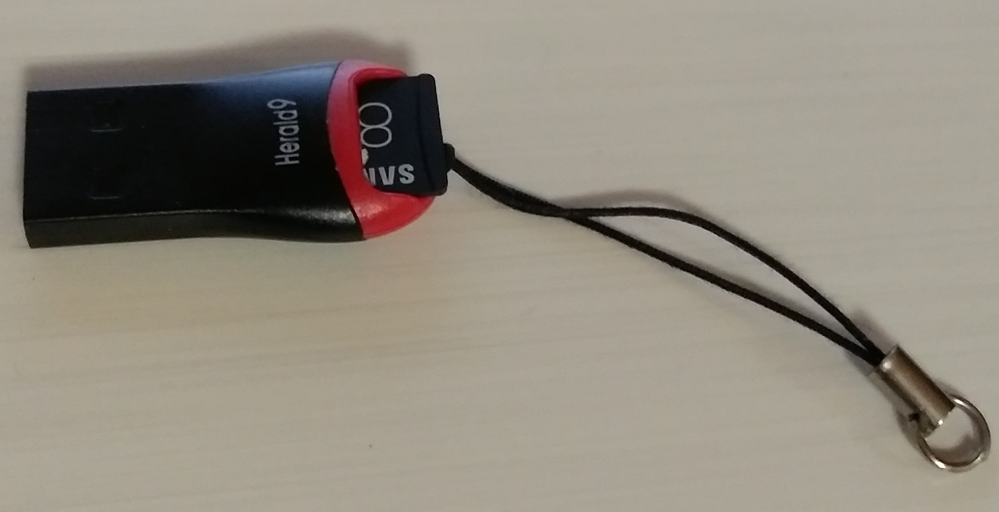
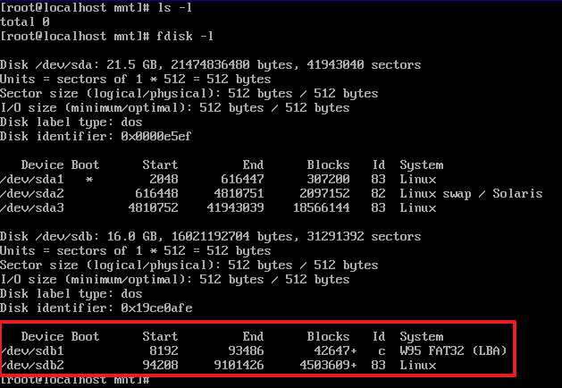
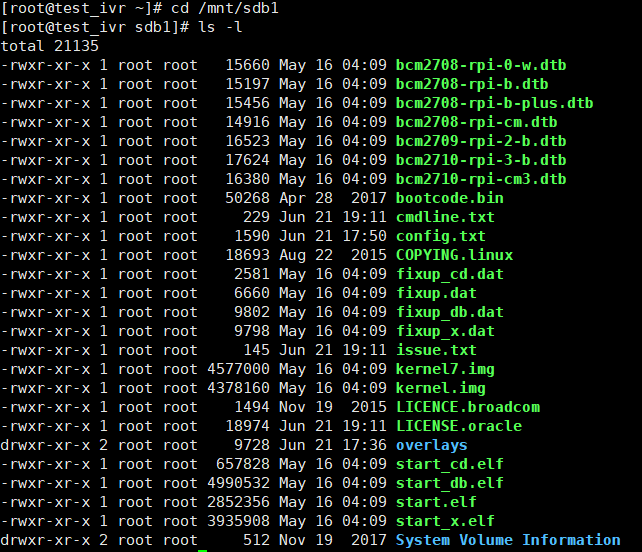

# RaspberryPi-For-Makers

## 1장
### 헤더리스 이미지 만들기
처음 라즈비안 이미지를 만든 다음 초기 세팅을 헤드리스로 진행하려면 몇가지 문제가 있다. 
먼저 SSH 서비스가 2016년 11월부터는 다운로드 이미지에서 막혀있다. 그리고 네트워크는 유선랜에서만 dhcp모드로 작동한다. 파이3부터는 WiFi가 지원되기 때문에 WiFi세팅만 가능하다면 랜케이블 연결없이 네트워크 접속이 가능하다. 
파이 부팅 없이 SD 카드의 라즈비안 이미지를 수정해 SSH 서비스 활성화, WiFi 설정을 해보겠다. 이 작업이 성공하면 파이를 헤드리스 모드로 부팅한 다음 PC에서 SSH로 바로 접속이 가능하다. 
SD카드 이미지는 두개의 파티션으로 이루어져 있다. 만약 Win32DiskImager를 사용해서 SD카드를 만들었다면 첫번째 BOOT 파티션은 FAT32이다. 그리고 두번째 파티션은 ext4 포맷이다. 이 두번째 파티션에 실제 라즈비안이 운영체제가 들어있다. ext4는 리눅스 시스템에서 사용하는 파일 시스템으로 PC에서는 지원하지 않기 때문에 보이지 않는다. 따라서 ext4 파일 시스템을 들여다 보려면 리눅스 시스템이 필요하다. 만약 PC 사용자라면 가상 머신을 이용하면 된다. 오라클 VirtualBox, 델의 VMware player 등의 무료 프로그램을 사용해 리눅스 OS를 설치하거나 이미지를 구해서 작업을 진행한다. 또다른 파이를 이용하는 것도 좋은 방법이다. 이하 모든 작업은 root권한으로 작업한다.  

#### MicroSD 카드 확인
아래 그림과 같은 USB 아답터에 라즈비안 이미지가 들어있는 Micro SD 카드를 넣은 후 리눅스 시스템이 작동중인 PC USB포트에 삽입한다.

만약 가상 머신을 사용한다면 리눅스 가상 머신에게 USB 디바이스의 소유권을 넘겨준다. 만약 리눅스 시스템에서 정상적으로 USB를 인식한다면 다음과 같이 확인 가능하다.

fdisk 명령으로 /dev/디렉토리에 sdb1,sdb2가 있으며 앞에서 설명한 것처럼 SD카드가 2개의 파티션으로 구성된 것을 보여주는 것이다.  

#### MicroSD 카드 마운트
/dev/sdb1, /dev/sdb2와 같은 저장 장치를 이용하려면 마운트를 해야 한다. 다음과 같이 마운트를 한다. 먼저 /mnt 디렉토리에 sdb1.sdb2 디렉토리를 만든다. 
* #mkdir /mnt/sdb1 
* #mkdir /mnt/sdb2 
* #mount /dev/sdb1 /mnt/sdb1 
* #mount /dev/sdb2 /mnt/sdb2  

이제 /mnt/sdb1, /mnt/sdb2 디렉토리로 이동해서 작업이 가능하다. 다음과 같이 PC에서 보이지 않던 파일 정보들이 보인다.
 

#### SSH 활성화
SSH 서비스 활성화는 /mnt/sdb1 (BOOT 파티션)에 ssh 이름의 빈 파일(사이즈 0)를 만들어 주면 된다.  
* #touch /mnt/sdb1/ssh  

#### WiFi 셋업
WiFi 셋업은 공유기 정보와 접속 암호를 알고 있다는 가정하에 진행한다.
만약 ssid가 _YourSSID_ , 공유기 암호가 _passwd_ 라고 가정하자.  

wpa_supplicant 파일을 수정한다.
* #vi /mnt/sdb2/etc/wpa_supplicant/wpa_supplicant.conf

다음과 같이 공유기 정보를 추가한다. 
_ctrl_interface=DIR=/var/run/wpa_supplicant GROUP=netdev
update_config=1  
network={ 
    ssid="YourSSID" 
    psk="passwd" 
}_

그리고 다음은 dhcpcd.conf 파일을 수정한다. 
* #vi /mnt/sdb2/etc/dhcpcd.conf

dhcpd.conf 파일 수정 내용은 본문을 참조한다. 

#### 마무리
마운트를 해제하고 SD카드를 제거 한 다음 파이에 넣어서 작동시키면 된다.
* #umount /dev/sdb1  
* #umount /dev/sdb2   
